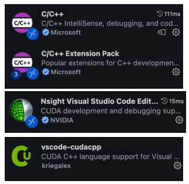
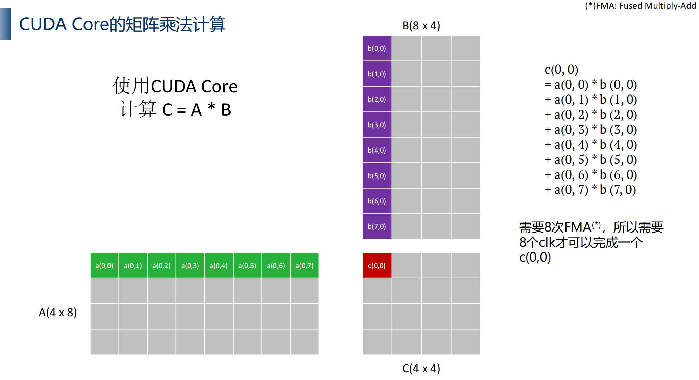
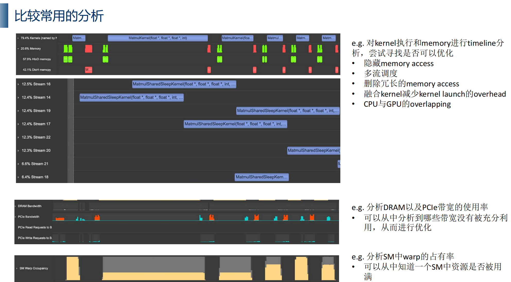
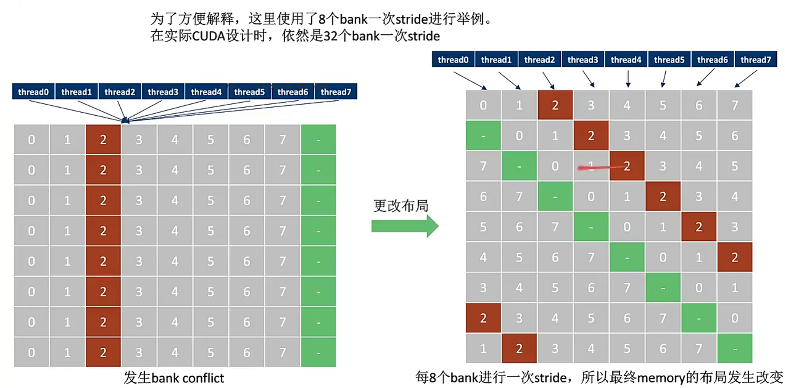
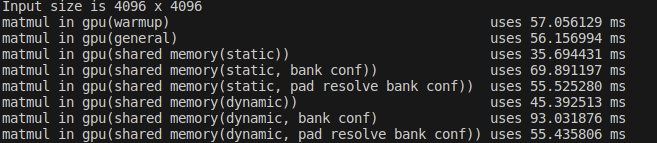
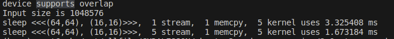
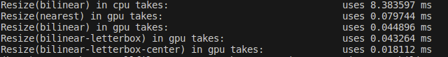
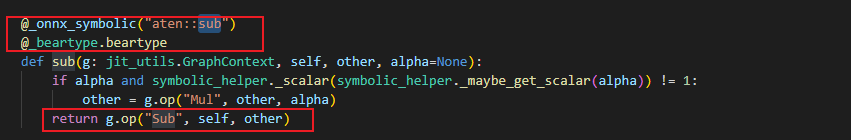

# 模型优化基础知识
##
# Tensorrt环境配置
根据tensorrt版本再选择相应的cuda和cudnn

# 一、tensorrt安装	
- 可以查看Tensorrt匹配的cuda和cudnn版本地址：https://docs.nvidia.com/deeplearning/tensorrt/release-notes/index.html
- Tensorrt 保存在任意文件夹都可以的,记得在 ~/.bashrc 上加上PATH即可
```
export PATH="/home/ubuntu/Public/TensorRT-8.5.1.7/bin:$PATH"
export LD_LIBRARY_PATH="/home/ubuntu/Public/TensorRT-8.5.1.7/lib:$LD_LIBRARY_PATH"
```

# 二、cudnn安装教程
- 官方地址：https://docs.nvidia.com/deeplearning/cudnn/install-guide/index.html
- 使用 Tar File Installation
# 三、nvidia docker 
## 1.NVIDIA 获取已有docker容器地址 
- 该地址是查看有版本container：https://catalog.ngc.nvidia.com/orgs/nvidia/containers/tensorrt/tags
- 改地址查看不同版本container包含什么版本的cuda、tensorrt： https://docs.nvidia.com/deeplearning/tensorrt/container-release-notes/index.html

## 2.启动镜像
```
#!/bin/sh/

docker run -it \                            #直接进入容器内
        --name trt_starter_${1} \           #指定容器的名字
  --gpus all \  #可以使用所有gpu
        -v /tmp/.X11-unix:/tmp/.X11-unix \ # 可以远程进行gui操作
        -v /home/ubuntu/Code:/home/ubuntu/Code\ # 挂载文件
  -p 8090:22 \                                # 主体的8090对container的22
        -e DISPLAY=:1 \
        trt_starter:cuda11.4-cudnn8-tensorrt8.2_${1}  #对应镜像版本
```


# 四、 vscoed配置
## 1. vscode插件安装

## 2. 配置
0.  agt-get install bear
1. make
```
make前记得修改../../config/Makefile.config文件内的cuda配置
	查看bear版本dpkg -l |grep bear
	2.4 版本 使用： bear make -j16
	3.0 以上版本使用：bear -- make -j16
```


2. 按ctl+shift+p 选择 c_cpp_properties.json，会在.vscode 生成c_cpp_properties.json文件
```
{
    "configurations": [
        {
            "name": "Linux",
            "includePath": [
                "${workspaceFolder}/**"
            ],
            "defines": [],
            "compilerPath": "/usr/bin/gcc",
            "cStandard": "c17",
            "cppStandard": "gnu++14",
            "intelliSenseMode": "linux-gcc-x64",
            "compileCommands": "${workspaceFolder}/compile_commands.json" #新增，compile_commands.json 是bear make后才有的
        }
    ],
    "version": 4
}
```

3. 配置language
查看地址：https://code.visualstudio.com/docs/languages/identifiers#:~:text=Language%20Identifiers%20In%20Visual%20Studio%20Code%2C%20each%20language,to%20a%20language%3A%20%22files.associations%22%3A%20%7B%20%22%2A.myphp%22%3A%20%22php%22%20%7D
```
在.vscode中创建settings.json 
加入
{
    "files.associations": {
        "*.cu": "cuda-cpp"
    }
}
```
4. task 配置
```
按ctl+shift+p 
选择 Configure.Task   
选择create   
选择other
会在.vscode文件夹中生成tasks.json 文件
{
    // See https://go.microsoft.com/fwlink/?LinkId=733558
    // for the documentation about the tasks.json format
    "version": "2.0.0",
    "tasks": [
        {
            "label": "make",  #修改
            "type": "shell",
            "command": "make -j16" #修改
        }
    ]
}
```
5. debug 配置
```
按ctl+shift+p 
选择dubug：Add  Configure
选择CUDAC++(CUDA-GDB)
{
    // Use IntelliSense to learn about possible attributes.
    // Hover to view descriptions of existing attributes.
    // For more information, visit: https://go.microsoft.com/fwlink/?linkid=830387
    "version": "0.2.0",
    "configurations": [
        {
            "name": "CUDA C++: Launch",
            "type": "cuda-gdb",
            "request": "launch",
            "program": "${workspaceFolder}/trt-cuda"  #修改  trt-cuda 要与config/Makefile.config 内APP的名字一致
        },
        {
            "name": "CUDA C++: Attach",
            "type": "cuda-gdb",
            "request": "attach"
        }
    ]
}

bebug还是会报错error while loading shared libraries: libncursesw.so.5: cannot open shared object file
原因说明:https://blog.csdn.net/winter99/article/details/117464598
使用命令（首先确定有/lib/x86_64-linux-gnu/libncursesw.so.6）：sudo ln -s /lib/x86_64-linux-gnu/libncursesw.so.6 /lib/x86_64-linux-gnu/libncursesw.so.5
```

6. makefile

# 五、 cuda知识
## 1 数据传输
[cudaMalloc] 在device端分配空间
[cudaMallocHost] 在host端的pinned menory上分配空间

[cudaMemcpy]     将数据在host->devide,device->device，device->host 进行传输
[cudaMemcpyAsync] 以异步的方式进行传输

## 2. 同步
[cudaDeviceSynchronize()]
```
等待所有线程都处理完成（kernel function处理完成）
用在cpu的c code中
```
[cudaThreadSynchronize()]
```
功能和cudaDeviceSynchronize()基本上一样，这个函数在新版本的cuda中已经被“废弃”了，不推荐使用，如果程序中真的需要做同步操作，推荐使用cudaDeviceSynchronize()。
```
[cudaStreamSynchronize()]
```
和上面的两个函数类似，这个函数带有一个参数，cuda流ID，它只阻塞那些cuda流ID等于参数中指定ID的那些cuda例程，对于那些流ID不等的例程，还是异步执行的。
```
[syncthreads()]
```
用在kernel function中，只在一个block中有效，等待本block中的所有threads计算完成，一般配合
```
## 3 cuda core 矩阵乘法运算

- 一个block中thread数不能超过1024，大于1024会显示配置错误

## 4 工具使用：Nsight systems & Nisght compute 查看计算瓶颈
- Nsight systems 全局查看核函数、内存、调度
    
    - 简单使用说明：https://blog.csdn.net/zhuikefeng/article/details/129989441
- Nisght compute 偏向核函数内部

## 5. shared memory(重要)
### 为什么能加速（原理）
### memory分类（global memory & shared memory）
- 例如从矩阵乘法会从globalmemory中重复获取数据
- global memory 延迟是最高的
### 动态/静态变量的注意事项

### bank confict
#### 基础概念
- GPU调度执行流程：
    - SM调度单位为一个warp（一个warp内32个Thread）
    - shared_memory 可以 被一个warp中的所有（32个）线程进行访问
- bank读写规则
    - 当多个线程读写同一个Bank中的数据时，会由硬件把内存读写请求，拆分成 conflict-free requests，进行顺序读写
    - 特别地，当一个warp中的所有线程读写同一个地址时，会触发broadcast机制，此时不会退化成顺序读
- bankconfict定义
    - 在访问shared memory时，因多个线程读写同一个Bank中的不同数据地址时，导致shared memory 并发读写 退化 成顺序读写的现象叫做Bank Conflict
- bankconfict解决办法
    - shared memory多加一列，更改布局，使同时访问不同的bank
    借用网上图片
#### 耗时
- 有bank configct 即使解决了耗时还是很长


## 6. Stream 和 Event
- stream定义：同一个流的执行顺序和各个kernel以及mempry operation的启动的顺序是一致的，但是，*只要资源没有被占用，不同流之间的执行是可以overlap的*。
- stream测试结果,提升约一倍速度
    
- 代码注意部分
```
/* n stream，处理一次memcpy，以及n个kernel */
void SleepMultiStream(
    float* src_host, float* tar_host,
    int width, int blockSize, 
    int count) 
{
    int size = width * width * sizeof(float);

    float *src_device;
    float *tar_device;

    CUDA_CHECK(cudaMalloc((void**)&src_device, size));
    CUDA_CHECK(cudaMalloc((void**)&tar_device, size));


    /* 先把所需要的stream创建出来，在数据传输（H2D、D2H）和 kernel中都需要用到，最后需要把stream释放掉 */
    cudaStream_t stream[count];
    for (int i = 0; i < count ; i++) {
        CUDA_CHECK(cudaStreamCreate(&stream[i]));
    }

    for (int i = 0; i < count ; i++) {
        for (int j = 0; j < 1; j ++) 
            /*注意使用cudaMemcpyAsync异步数据传输*/
            CUDA_CHECK(cudaMemcpyAsync(src_device, src_host, size, cudaMemcpyHostToDevice, stream[i])); 
        dim3 dimBlock(blockSize, blockSize);
        dim3 dimGrid(width / blockSize, width / blockSize);

        /* 这里面我们把参数写全了 <<<dimGrid, dimBlock, sMemSize, stream>>> */
        SleepKernel <<<dimGrid, dimBlock, 0, stream[i]>>> (MAX_ITER);
        CUDA_CHECK(cudaMemcpyAsync(src_host, src_device, size, cudaMemcpyDeviceToHost, stream[i]));
    }


    CUDA_CHECK(cudaDeviceSynchronize());


    cudaFree(tar_device);
    cudaFree(src_device);

    for (int i = 0; i < count ; i++) {
        // 使用完了以后不要忘记释放
        cudaStreamDestroy(stream[i]);
    }

}

```


## 7. 双线性差值实践
### 测试结果

```
- 基础知识：
    使用opencv读取图像时图像的排列方式是一个三维数组，但并非是三维数组按照[r:[[]] g:[[]] b:[[]]] 然后组合的方式存储。
    图片的存储方式可以理解成有个长 * 宽 的矩阵 矩阵的每一个点包括[b, g, r]三个点的数据 是按照*[b,g,r][b,g,r]* 的方式存储
```
- [opencv安装流程]
官网：https://docs.opencv.org/4.x/d7/d9f/tutorial_linux_install.html
参考网上该方法： https://zhuanlan.zhihu.com/p/667391183

- [coda](../Data/cuda/bilinear_interpolation.cu)

# 六、Tensorrt介绍
- NVIDIA GPU的一种优化编译器
    - 自动优化模型
        - 寻找模型中可以并行的地方
        - 针对当前gpu框架，寻找最优的调度和并行策略
    - 支持多框架输入
        - onnx
    - python/c++ API接口

- Tensorrt模块
    - 工作流
        
    - layer fusion
        - vertical layer fusion(垂直层融合)
            - 常见的：conv+bn+relu
        - horizontal layer fusion(水平层融合)
    - 优化策略
        - kernel auto-tuning 
        - Quantization(量化)
            - FP32->FP16
            - FP32->INT8

# 七、 torch导出onnx
```
    input   = torch.zeros(1, 1, 1, 4)
    weights = torch.tensor([
        [1, 2, 3, 4],
        [2, 3, 4, 5],
        [3, 4, 5, 6]
    ],dtype=torch.float32)
    model   = Model(4, 3, weights)
    model.eval() #添加eval防止权重继续更新

    # pytorch导出onnx的方式，参数有很多，也可以支持动态size
    # 我们先做一些最基本的导出，从netron学习一下导出的onnx都有那些东西
    torch.onnx.export(
        model         = model,                    #模型
        args          = (input,),                 #输入
        f             = "../models/example.onnx", #导出路径
        input_names   = ["input0"],               #输入key
        output_names  = ["output0"],              #输出key
        dynamic_axes  = {                         #动态batch
            'input0':  {0: 'batch'},              # 输入的input0的第0维度
            'output0': {0: 'batch'}
        },
        opset_version = 12)                       #onnx指令版本
```

# 八、 onnx架构
```
onnx的各类proto的定义需要看官方文档 (https://github.com/onnx/onnx/tree/main)
这里面的onnx/onnx.in.proto定义了所有onnx的Proto
有关onnx的IR(intermediate representation)信息，看这里(https://github.com/onnx/onnx/blob/main/docs/IR.md)
```
## ONNX的结构
- ModelProto （整个模型的信息,比如opset）
    - GraphProto （整个网络的信息）
        - NodeProto （计算节点，比如conv，linear）
        - TensorProto （tensor信息，主要是权重）
        - ValueInfoProto （input/output信息）
- ProtoBuf
## 通过onnx.helper创建onnx
```
def create_onnx():
    # 创建ValueProto
    a = helper.make_tensor_value_info('a', TensorProto.FLOAT, [10, 10])
    x = helper.make_tensor_value_info('x', TensorProto.FLOAT, [10, 10])
    b = helper.make_tensor_value_info('b', TensorProto.FLOAT, [10, 10])
    y = helper.make_tensor_value_info('y', TensorProto.FLOAT, [10, 10])

    # 创建NodeProto
    # op_type 如 'Add''Mul' 在这里查看 https://onnx.ai/onnx/operators/ 不能乱写
    mul = helper.make_node('Mul', ['a', 'x'], 'c', "multiply")
    add = helper.make_node('Add', ['c', 'b'], 'y', "add")

    # 构建GraphProto
    graph = helper.make_graph([mul, add], 'sample-linear', [a, x, b], [y])

    # 构建ModelProto
    model = helper.make_model(graph)

    # 检查model是否有错误
    onnx.checker.check_model(model)
    # print(model)

    # 保存model
    onnx.save(model, "../models/sample-linear.onnx")

    return model
```

## torch.onnx 和 ONNX中注册算子
### 目的：解决pytorch导出onnx时算子不兼容的情况
1. 确保torch.onnx 中算子有实现（PyTorch 算子）
2. 确保torch.onnx 中算子有登记（映射方法）
3. 确保onnx 中有相应算子（ONNX 算子）

- 相应方法：
    - PyTorch 算子
        - 组合现有算子
        - 添加 TorchScript 算子
        - 添加普通 C++ 拓展算子
    - 映射方法
        - 为 ATen 算子添加符号函数
        - 为 TorchScript 算子添加符号函数
        - 封装成 torch.autograd.Function 并添加符号函数
    - ONNX 算子
        - 使用现有 ONNX 算子
        - 定义新 ONNX 算子
### 解决思路
参考地址：https://zhuanlan.zhihu.com/p/513387413
#### 修改opset的版本
• 查看不支持的算子在新的opset中是否被支持,也可以挨个版本测试
• 如果不考虑自己搭建plugin的话，也需要看看onnx-trt中这个算子是否被支持(*)  -> https://onnx.ai/onnx/operators/
• 需要习惯看官网文档

#### 替换pytorch中的算子组合
• 把某些计算替换成onnx可以识别的

#### 在pytorch登记onnx中某些算子
- 有可能onnx中有支持，但pytorch没有被登记->进入torch.onnx.symbolic_opset9.py 中参照代码格式进行登记,torch版本不同登记方式也不一样

- 创建自定义的算子并且在torch.onnx中登记
- 使用torch.autograd.Function方法(可以用来组装已有的一些torch算子)
```
# 实际用onnxruntime推理的时候会报错，因为onnx中还没有该算子，但是netron能看到
import torch
import torch.onnx
import onnxruntime
from torch.onnx import register_custom_op_symbolic

OperatorExportTypes = torch._C._onnx.OperatorExportTypes

class CustomOp(torch.autograd.Function):
    @staticmethod 
    def symbolic(g: torch.Graph, x: torch.Value) -> torch.Value:
        return g.op("custom_domain::customOp2", x)

    @staticmethod
    def forward(ctx, x: torch.Tensor) -> torch.Tensor:
        ctx.save_for_backward(x)
        x = x.clamp(min=0)
        return x / (1 + torch.exp(-x))

customOp = CustomOp.apply

class Model(torch.nn.Module):
    def __init__(self):
        super().__init__()
    
    def forward(self, x):
        x = customOp(x)
        return x


def validate_onnx():
    input   = torch.rand(1, 50).uniform_(-1, 1).reshape(1, 2, 5, 5)

    # PyTorch的推理
    model = Model()
    x     = model(input)
    print("result from Pytorch is :\n", x)

    # onnxruntime的推理
    sess  = onnxruntime.InferenceSession('../models/sample-customOp2.onnx')
    x     = sess.run(None, {'input0': input.numpy()})
    print("result from onnx is:    \n", x)

def export_norm_onnx():
    input   = torch.rand(1, 50).uniform_(-1, 1).reshape(1, 2, 5, 5)
    model   = Model()
    model.eval()

    file    = "../models/sample-customOp2.onnx"
    torch.onnx.export(
        model         = model, 
        args          = (input,),
        f             = file,
        input_names   = ["input0"],
        output_names  = ["output0"],
        opset_version = 12)
    print("Finished normal onnx export")

if __name__ == "__main__":
    export_norm_onnx()

    # 自定义完onnx以后必须要进行一下验证
    validate_onnx()
```

- 使用 TorchScript 算子方法
```
import torch 
import torchvision 
 
class Model(torch.nn.Module): 
    def __init__(self): 
        super().__init__() 
        self.conv1 = torch.nn.Conv2d(3, 18, 3) 
        self.conv2 = torchvision.ops.DeformConv2d(3, 3, 3) 
 
    def forward(self, x): 
        return self.conv2(x, self.conv1(x)) 
 
from torch.onnx import register_custom_op_symbolic 
from torch.onnx.symbolic_helper import parse_args 
# 装饰器 @parse_args TorchScript 算子的符号函数要求标注出每一个输入参数的类型。比如"v"表示 Torch 库里的 value 类型，一般用于标注张量，而"i"表示 int 类型，"f"表示 float 类型，"none"表示该参数为空
@parse_args("v", "v", "v", "v", "v", "i", "i", "i", "i", "i", "i", "i", "i", "none") 
def symbolic(g,  
        input, 
        weight, 
        offset, 
        mask, 
        bias, 
        stride_h, stride_w, 
        pad_h, pad_w, 
        dil_h, dil_w, 
        n_weight_grps, 
        n_offset_grps, 
        use_mask): 
    # g.op() 是用来定义 ONNX 算子的函数
    return g.op("custom::deform_conv2d", input, offset) 
 
register_custom_op_symbolic("torchvision::deform_conv2d", symbolic, 9) 
 
model = Model() 
input = torch.rand(1, 3, 10, 10) 
torch.onnx.export(model, input, 'dcn.onnx') 
```
#### 直接修改onnx，创建plugin
-  使用onnx-surgeon
    - onnx_graphsurgeon 安装：python -m pip install onnx_graphsurgeon --index-url https://pypi.ngc.nvidia.com
    - onnx_graphsurgeon作用（先比onnx.helper）：
        - 可以更方便的添加/修改onnx节点
        - 可以更方便的修改子图
        - 可以更方便的替换算子（结合tensorrt的算子plugin）

# 九、 TensorRT
## 使用trtexec 将onnx转成engine
- 查看trtexec参数：https://docs.nvidia.com/deeplearning/tensorrt/developer-guide/index.html#trtexec
    - Flags for the Build Phase 构建engine的参数
    - Flags for the Inference Phase 推理的参数
- build engine
```
#.sh文件
#!/bin/bash
# how to use:
#   bash tools/build.sh ${input.onnx} ${tag}

IFS=. file=(${1})
IFS=/ file=(${file})
IFS=
PREFIX=${file[1]}


if [[ ${2} != "" ]]
then
        PREFIX=${PREFIX}-${2}
fi

MODE="build"
ONNX_PATH="models"
BUILD_PATH="build"
ENGINE_PATH=$BUILD_PATH/engines
LOG_PATH=${BUILD_PATH}"/log/"${PREFIX}"/"${MODE}

mkdir -p ${ENGINE_PATH}
mkdir -p $LOG_PATH

trtexec --onnx=${1} \
        --memPoolSize=workspace:2048 \
        --saveEngine=${ENGINE_PATH}/${PREFIX}.engine \
        --profilingVerbosity=detailed \
        --dumpOutput \
        --dumpProfile \
        --dumpLayerInfo \
        --exportOutput=${LOG_PATH}/build_output.log\
        --exportProfile=${LOG_PATH}/build_profile.log \
        --exportLayerInfo=${LOG_PATH}/build_layer_info.log \
        --warmUp=200 \
        --iterations=50 \
        > ${LOG_PATH}/build.log
        #选择项--fp16


```
## Quantization（量化）
### （symmetric quantization）对称映射和（asymmetric quantization）非对称映射
- NVIDIA默认的mapping就是对称量化，因为快
### PTQ和QAT
- 训练后量化 : 简称 PTQ（Post Training Quantization）：权重量化，激活量化，需要借助数据在训练后进行校准。
- 静态量化感知训练 : 简称 QAT（static quantization aware training）：权重量化，激活量化，*在训练过程中*的量化数值进行建模。
### calibration(校准)
- 权重是固定的，所以可以通过一次计算就可以得到每一层的量化参数。但是activation value(激活值)是根据输入的改变而改变的
### Quantization Granularity（量化粒度）
- 分类：per-tensor、per-channel、per-element
- 什么时候用那种量化，nvidia实验结论：
    - 对于activation values，选取per-tensor量化
    - 对于weights，选取per-channel量化，如conv
        - 1.因为BN计算与线性conv计算的融合 (BN folding)，BN是per-channel的
        - 2.depthwise convolution 也是per-channel的
    - *目前的TensorRT已经默认对于Activation values选用Per-tensor，Weights选用*
Per-channel

### 量化技巧
### 掉精度时需要做的事情
