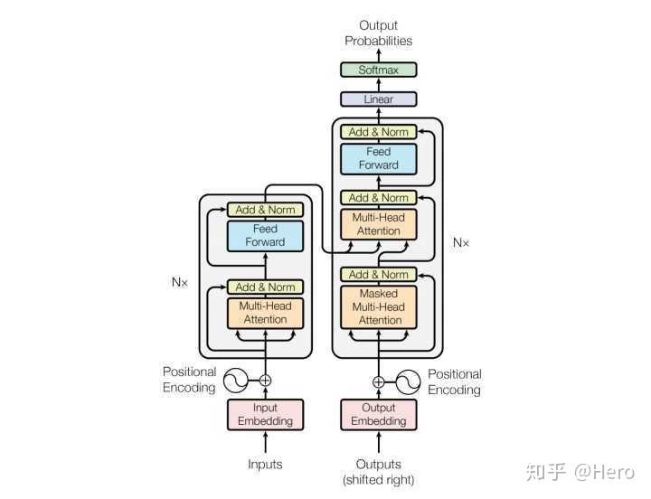
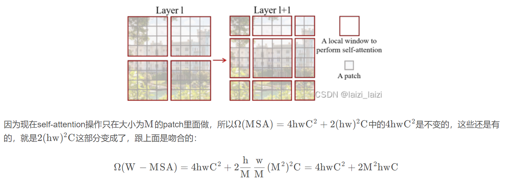
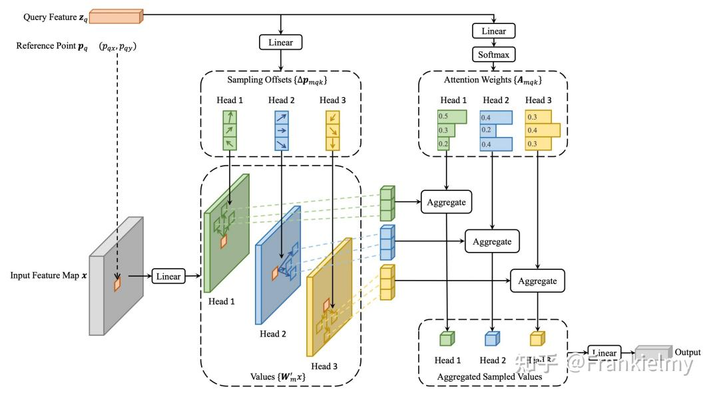

# Transformer

## 模块
### position encoding
```
PE(pos,2i)=sin(pos/1000^(2i/dim))
PE(pos,2i+1)=cos(pos/1000^(2i/dim))
pos->词语在序列中的位置
i  ->词语向量中某个值的位置
dim->模型维度(词语向量维度)
```
```
## PositionalEncoding 代码实现
class PositionalEncoding(nn.Module):
    def __init__(self, d_model, dropout=0.1, max_len=5000):
        super(PositionalEncoding, self).__init__()
 
        ## 位置编码的实现其实很简单，直接对照着公式去敲代码就可以，下面这个代码只是其中一种实现方式；
        ## 从理解来讲，需要注意的就是偶数和奇数在公式上有一个共同部分，我们使用log函数把次方拿下来，方便计算；
        ## pos代表的是单词在句子中的索引，这点需要注意；比如max_len是128个，那么索引就是从0，1，2，...,127
        ##假设我的demodel是512，2i那个符号中i从0取到了255，那么2i对应取值就是0,2,4...510
        self.dropout = nn.Dropout(p=dropout)
 
        pe = torch.zeros(max_len, d_model)
        position = torch.arange(0, max_len, dtype=torch.float).unsqueeze(1)
        div_term = torch.exp(torch.arange(0, d_model, 2).float() * (-math.log(10000.0) / d_model))
        pe[:, 0::2] = torch.sin(position * div_term)## 这里需要注意的是pe[:, 0::2]这个用法，就是从0开始到最后面，补长为2，其实代表的就是偶数位置
        pe[:, 1::2] = torch.cos(position * div_term)##这里需要注意的是pe[:, 1::2]这个用法，就是从1开始到最后面，补长为2，其实代表的就是奇数位置
        ## 上面代码获取之后得到的pe:[max_len*d_model]
 
        ## 下面这个代码之后，我们得到的pe形状是：[max_len*1*d_model]
        pe = pe.unsqueeze(0).transpose(0, 1)
 
        self.register_buffer('pe', pe)  ## 定一个缓冲区，其实简单理解为这个参数不更新就可以
 
    def forward(self, x):
        """
        x: [seq_len, batch_size, d_model]
        """
        x = x + self.pe[:x.size(0), :]
        return self.dropout(x)
```
### attention
### multi-head attention
### maskattention
## 复杂度计算

## code

# Swin-transformer



# deformable
