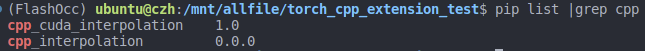

pytorch_cpp_cuda扩展
---
- 官网：https://pytorch.org/tutorials/advanced/cpp_extension.html
- 参考地址（mmcv）：https://zhuanlan.zhihu.com/p/348555597
- 参考视频：https://www.youtube.com/watch?v=oG0WUq3bRz0&list=PLDV2CyUo4q-LKuiNltBqCKdO9GH4SS_ec&index=6

[demo code文件夹](./torch_cpp_extension_test/)
1. vscode配置环境
```
# settings.json
#增加cu文件高亮提示
{
    "files.associations": {
        "*.cu": "cuda-cpp",
        "ratio": "cpp",
        "string": "cpp"
    }

}
```
2. 通过setuptools编译
```
# setup.py
import glob
import os.path as osp
from setuptools import setup, Extension
from torch.utils.cpp_extension import CppExtension,CUDAExtension,BuildExtension

ROOT_DIR = osp.dirname(osp.abspath(__file__))
include_dirs = [osp.join(ROOT_DIR,"include")]  #头文件所在文件夹
source = glob.glob('*.cpp')+glob.glob('*.cu')  #需要编译的cpp和cu文件 


# cpp 扩展
# setup(
# name="cpp_interpolation",
# ext_modules=[CppExtension(
#     name="cpp_interpolation",
#     sources=["interpolation.cpp"],
# )],
# cmdclass={'build_ext':BuildExtension}
# )

# cuda 扩展
setup(
    name="cpp_cuda_interpolation",
    version = '1.0',
    ext_modules=[CUDAExtension(
        name="cpp_cuda_interpolation", #setup完成后 import使用的名称
        sources=source,
        include_dirs=include_dirs,
        # extra_compile_args= { #减少代码大小跟运行速度无关，选不选择都可以
        #     'cxx':['-02'],
        #     'nvcc':['-02']
        # }
    )],
    cmdclass={'build_ext':BuildExtension}
)

```
```
# 在setup所在目录下，使用以下命令执行
pip install . 
```
执行后结果

3. 连接python
```
#include <torch/extension.h>
#include "utils.hpp"

torch::Tensor trilinearinterpolation(torch::Tensor feats,torch::Tensor point)
{   
    CHECK_INPUT(feats);
    CHECK_INPUT(point);
    return trilinearinterpolation_cu(feats,point);
}

torch::Tensor trilinearinterpolation_bw(const torch::Tensor dL_dfeats_interp,torch::Tensor feats,torch::Tensor point)
{   
    CHECK_INPUT(dL_dfeats_interp);
    CHECK_INPUT(feats);
    CHECK_INPUT(point);
    return trilinearinterpolation_bw_cu(dL_dfeats_interp,feats,point);
}
// 通过该函数连接python
PYBIND11_MODULE(TORCH_EXTENSION_NAME,m)
{
    m.def("trilinearinterpolation",&trilinearinterpolation);     #"trilinearinterpolation"为python实际调用的函数名
    m.def("trilinearinterpolation_bw",&trilinearinterpolation_bw);
}
```
4. [cu前向传播&反向传播](./torch_cpp_extension_test/interpolation_kernel.cu)
5. torch.autograd.Function 封装
```
import torch
import time 
import cpp_interpolation
import cpp_cuda_interpolation

class trilinear_interpolation_cuda(torch.autograd.Function):
    @staticmethod
    def forward(ctx,feats,points):
        feat_interp = cpp_cuda_interpolation.trilinearinterpolation(feats,points)
        ctx.save_for_backward(feats,points)
        return feat_interp
    @staticmethod
    def backward(ctx,dl_dfeat_interp):
        feats,points = ctx.saved_tensors
        dl_dfeats = cpp_cuda_interpolation.trilinearinterpolation_bw(dl_dfeat_interp.contiguous()
                                                                     ,feats
                                                                     ,points)
        #跟forward输入要对齐，输入多少个就返回多少个，无梯度的补NONE
        return dl_dfeats, None

#调用示例
N = 5
F = 4
tem = torch.rand(N,8,F,device='cuda:0')
feats =  tem.clone().requires_grad_()
point = torch.rand(N,3,device='cuda:0')*2-1
out = trilinear_interpolation_cuda.apply(feats,point)
```
6.forward时间对比
```
cu:0.00011
py:0.00023
```