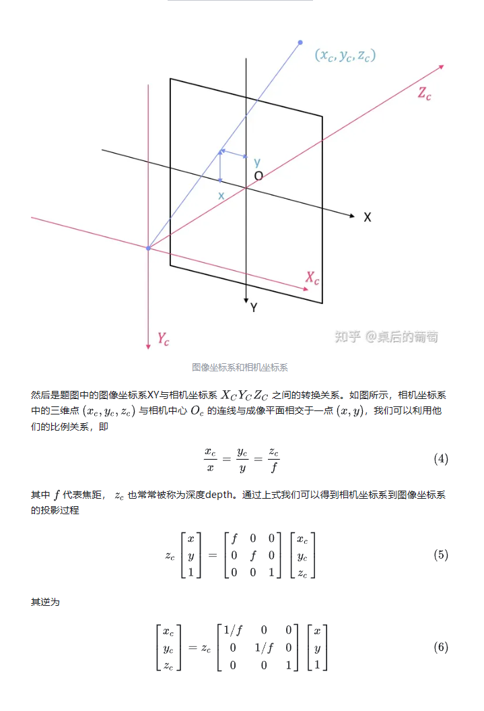
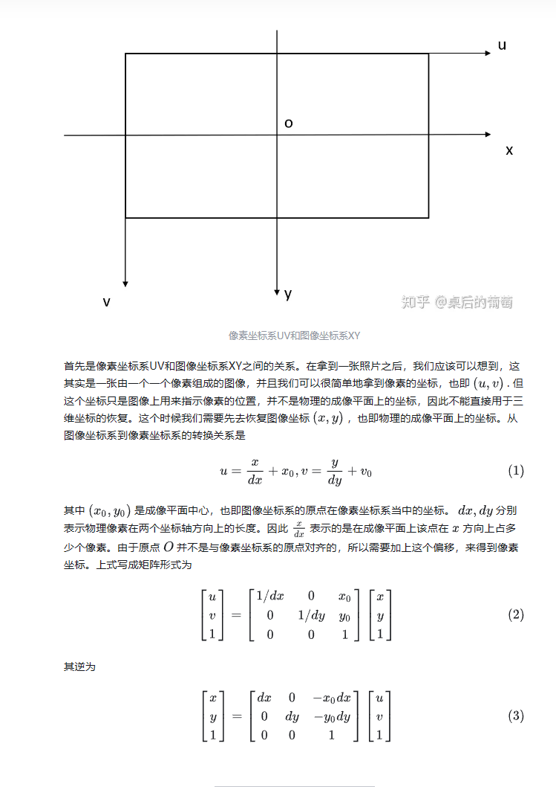

# 感知框架图

# 世界坐标、相机坐标、图像坐标、像素坐标、lidar坐标
## 相机坐标 到 图像坐标
- 参考：https://zhuanlan.zhihu.com/p/331832549

## 图像坐标 到 像素坐标
- 参考：https://zhuanlan.zhihu.com/p/331832549

## 逆矩阵求解（应用于不同坐标系间的转换）
1. 获取行列式

2. 通过原矩阵的伴随矩阵和行列式求解逆矩阵
- 伴随矩阵 通过各元素*代数余子式*构成的矩阵再*转置*得到

# BEV 多传感器融合
## 传感器
- [LIDAR] 比较清晰，下雪雾天易受影响
- [RADAR] 距离较远
- [CAMERA] 语义信息较多
- [SONAR] 距离较近

## 融合方式
- [Early前融合] 提取特征前融合
- [Late后融合] 提取特征后融合
- [Deep融合] 分别经过head后融合