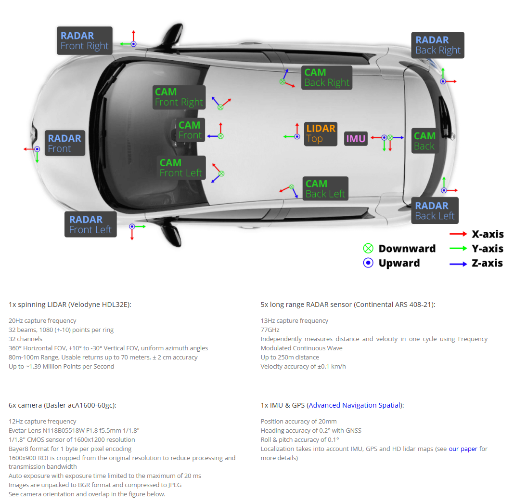
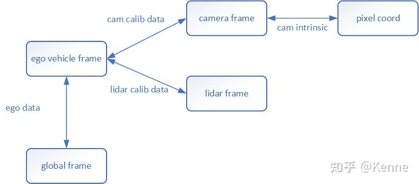

nuScenes 3D目标检测数据集
===
- 参考地址：https://blog.csdn.net/qq_16137569/article/details/121066977
- git：https://github.com/nutonomy/nuscenes-devkit
- 官网：https://www.nuscenes.org/nuscenes?tutorial=nuscenes（官网上有具体使用案例）

- **IMU 是惯性测量单元（Inertial Measurement Unit）的缩写**：用于测量和报告物体的三个基本线性运动（加速度）和三个基本角运动（角速度）
# 文件夹内容
- maps：地图数据，四张地图对应着4个数据采集地点
- samples：带有标注信息的关键帧数据，训练主要用这部分数据，samples文件夹中存储的信息是较为关键、重要的，而sweeps文件夹中的信息则相对次要。
- sweeps：完整时序数据，不带有标注信息，一般用于跟踪任务
- v1.0-version:存有数据依赖关系、标注信息、标定参数的各种json文件
# 标注信息
- 全局坐标系是绝对坐标系，是目标在地图中的绝对坐标，不随本车的运动而变化。标注真值的坐标是全局坐标系下的坐标。
# camer
## 基础配置
- 6台彩色相机，*1600×900的分辨率*，采用JPEG格式压缩，采样频率为*12Hz*
## 3DBBOX数据结构
## 坐标转化
# lidar
## 基础配置
- 1台32线旋转式激光雷达，*20Hz采样频率*，360°水平FOV，-30°-10°的垂直FOV，*探测距离70m*，探测*精度2cm*，每秒140万点云
## lidarseg数据结构
## 坐标转化
# 坐标变换

[code](./nuscenes_bbox坐标变换.py)

# 其他
## python四元数库-quaternion
- [测试代码](./pyquaternion_test.py)