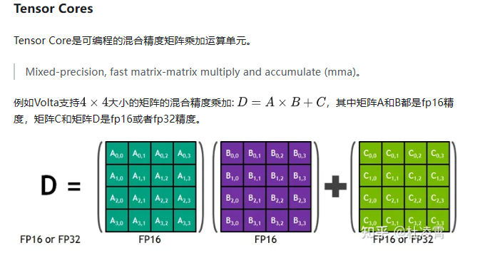
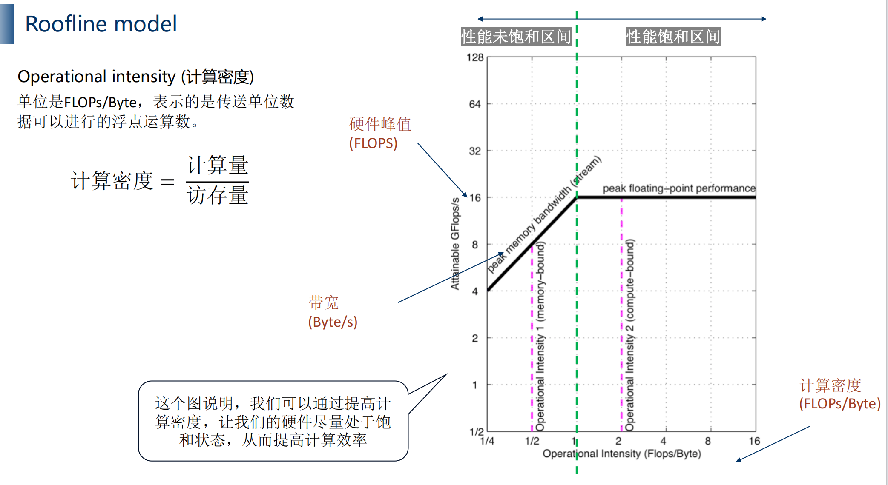

# 基础知识
## FLOPS/TOPS 区别
### FLOPS(floating point number operation per second)
- 每秒可以可以处理的浮动小数点运算次数
- FLOPS = 频率 * core数量 * 每个时钟周期可以处理的FLOPS
    - 比如说:
        - Intel i7 Haswell架构 (8核，频率3.0GHz)。
            - 那么它的FLOPS在双精度的时候就是：
            - 3.0 * 10^9 Hz * 8 core * 16 FLOPS/clk = 0.38 TFLOPS
        - 那么它的FLOPS在单精度的时候就是：
            - 3.0 * 10^9 Hz * 8 core * 32 FLOPS/clk = 0.76 TFLOPS
- 各种FLOPS
    - MFLOPS  10^6FLOPS
    - GFLOPS  10^9FLOPS
    - TFLOPS  10^12FLOPS
    - PFLOPS  10^15FLOPS
### TOPS
- 每秒可以处理的整型运算次数
### FLOPs（floating point number operations）
- 衡量模型大小的指标

## CUDA core 和 Tensor core 的区别
### CUDA core
一个时钟周期只能处理1个浮点fma操作
### Tensor core
一个时钟周期可以处理64个浮点fma操作

## Roofline model
### 目的
- 分析3x3 conv, 5x5 conv, 7x7 conv, 9x9 conv, 11x11 conv的计算效率
- 1x1 conv的计算效率
- depthwise conv的计算效率
- 分析目前计算的瓶颈(bottleneck)
- 分析模型的可以优化的上限
### Operational intensity（计算密度）

- 单位是FLOPs/Byte，表示传输单位数据可以进行的浮点运算数。
- 计算密度=计算量/访存量
    - 以卷积为例[Cin(输入channel数量)、Cout（输出channnel数量）、M（输出特征图HW）、k（卷积核）]
        - 计算量=M^2*K^2*Cin*Cout
        - 访存量（卷积核+输出特征图）*4bytes= (K^2*Cin*Cout+M^2*Cout)*4

# 模型部署误区
## FLOPs不能完全衡量模型性能
- 还需要考虑计算密度
- 前处理和后处理
## 有时候tensorrt不会分配Tensor core
- kernel auto tuning 自动选择最优解，有时候会出现int8的速度比fp16慢
- *使用Tensor core 需要让tensor size 是8 或者16的倍数*
    - 8的倍数：fp16精度
    - 16的倍数：int8精度
# 模型量化
# 模型减枝
# 层融合