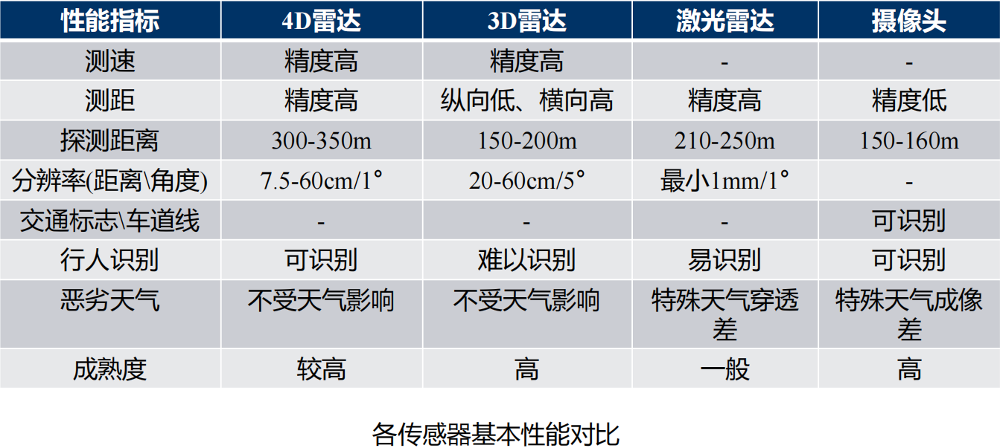
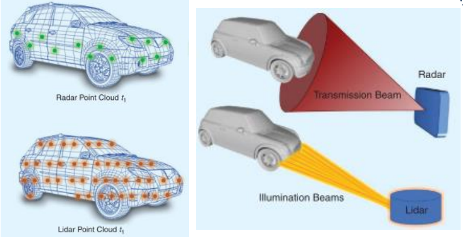
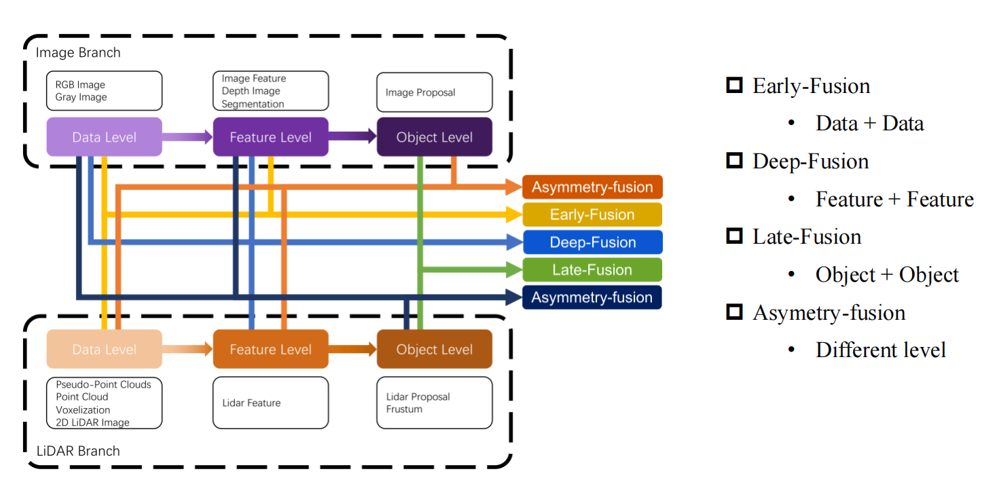
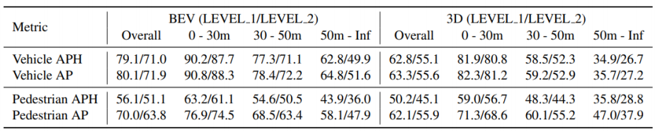
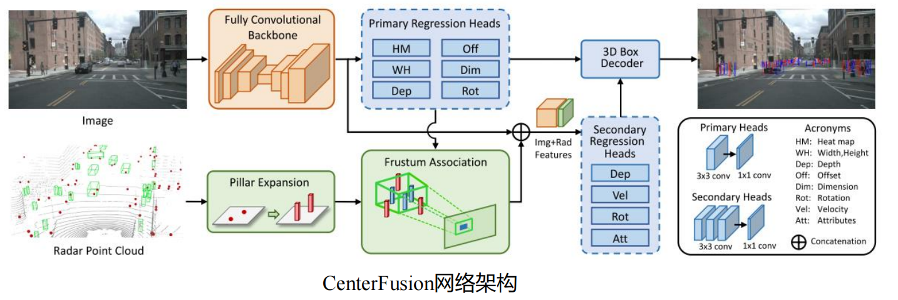
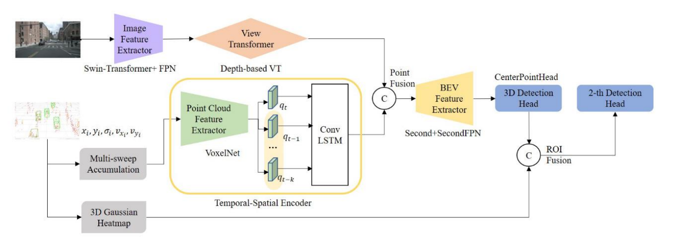
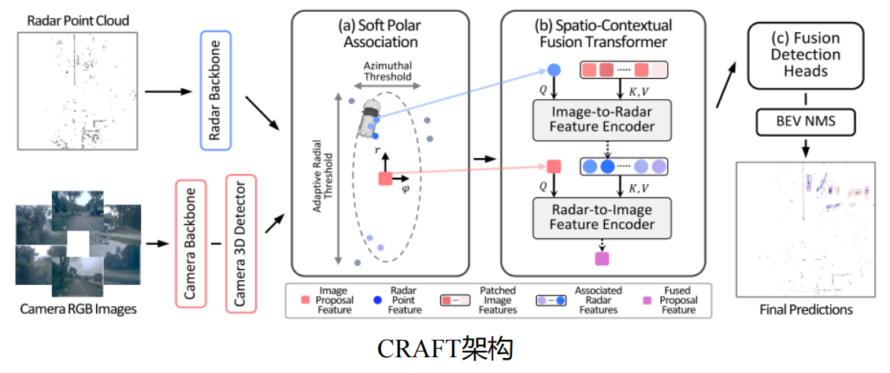
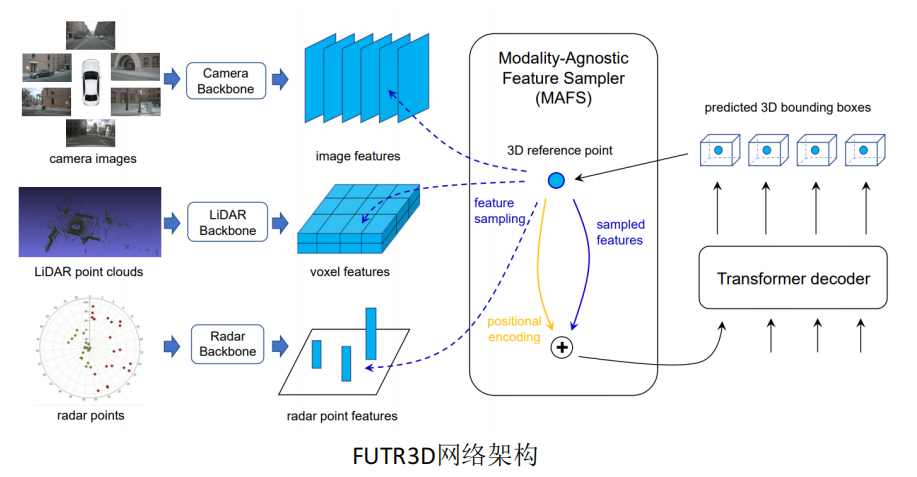

毫米波雷达
===
# 特性
1. 分类
    - 3D毫米波雷达:X Y V
        - 缺乏高度信息，无法辨别同距离桥洞与前车，虚警造成误刹
        - 不能很好地识别静止物体、物体高度或者区分相邻障碍物
    - 4D毫米波雷达:X Y Z V ()
        - 测高能力：增加了高度Z（俯仰角）信息
        - 更高的分辨率
        - 探测距离也能更远，最远可达到300m以上
        - 输出更密集的目标点云，因此有助于引入神经网络等AI算法处理数据
        - 对静态目标检测能力
2. 毫米波雷达跟其他传感器基础性能对比

3. 点云对比：毫米波雷达(Radar) v.s. 激光雷达（Lidar)
    |传感器|密度|对雨雾鲁棒性|测量径向速度|分布|
    |---|---|---|---|---|
    |lidar|密集|弱|不能|具有层次|
    |radar|稀疏|强|能|不规则|
    - 点云分布对比
    
# 点云基础算法
1. 聚类算法
2. 匹配算法
3. 滤波算法
   参考：https://zhuanlan.zhihu.com/p/138684962
4. 基于EKF/UKF的跟踪实战

# 点云目标检测

# 毫米波雷达视觉融合2D检测
相关论文&方法
1. CRF-NET
2. PPRN
3. FCOS
   - anchor free方法
   - 优势
     - 节省空间：减少推理时间，避免了复杂的IOU和匹配计算步骤，减小训练内存占用空间
     - 可拓展性：其他的视觉任务：关键点检测、3D等
4. SAF-FCOS
# 毫米波雷达视觉融合3D检测(重点关注该部分)
## 融合方式

Aysmmetry-fusion代表非对称融合，使用的不是同一level的数据

## 常用指标
1. Patr1
    - mAP:AP的阈值匹配不使用IoU来计算，而使用在地平面上的2D中心距离d(0.5,1,2,4)来计算。解耦了物体的尺寸和方向对AP计算的影响
    - mATE：Average Translation Error,中心点的平均平移误差(ATE) (单位为米).
    - mASE：Average Scale Error, 平均尺度误差(ASE) 是1 – IoU
    - mAOE：Average Orientation Error.平均角度误差(AOE) , 偏航角差
    - mAVE：Average Velocity Error.平均速度误差(AVE) , 二维速度差的L2 范数(m/s)
    - mAAE：Average Attribute Error,平均属性错误(AAE) 被定义为1−acc
    - NDS: 综合考虑mAP和各项指标，0-1 越高越好
       $$
       NDS=\frac{1}{10}[5mAP+\sum_{mTP\in{TP}}^{}(1-min(1,mTP))]
       $$
       - mTP代表上述mATE、mASE、mAOE、mAVE、mAAE
2. Part2
     - Waymo
       - 
       - 两个难度LEVEL1和LEVEL2
           - bbox内点数量小于5：LEVEL2
           - 其余LEVEL1
       - WOD还从距离远近来考察检测效果，0-30m，30-50m，50m以上
       - AP & APH，传统AP和平均角度误差
## 相关论文&方法
1. **CENTERFUSION**
   
    - 基于CenterNet(单阶段，基于中心点预测的方式来定位和识别目标)
    - 特征融合(Deep fusion)，利用雷达和相机进行3D物体检测
    - Pipeline：图像首次生成提议 -> 关联雷达数据 -> 生成融合特征图 -> 第二次回归
    - 双分支结构：
        - 图像分支生成初次目标提议
        - 雷达分支生成扩充特征
    - 贡献：
      - 去除Anchors，去除了耗时的NMS后处理操作，还可以应用3D目标检测与人体关键点检测等其它的任务
    - 问题
      1. Frustum Association具体如何操作的?
         - 根据object所在位置的frustum，获取该frustum内所有的pillar特征，和上面网路架构图表达一致
   - [详细内容在work路径内:TODO]()
2. **RCBEV**:Bridging the View Disparity of Radar and Camera Features for Multi-modal Fusion 3D Object Detection
   
   - 贡献
     1. 提出一种双阶段融合3D检测网络(Point Fusion & ROI Fusion)
     2. 使用Temporal Spatial Encoder(ConvLSTM)处理多帧雷达时序信息
     3. voxel特征和pillar特征对比，pillar特征表现要更好一点
   - [详细内容在work路径内:TODO]()
3. **CRAFT**:Camera-Radar 3D Object Detection with Spatio-Contextual Fusion Transformer
   
   - 动机：雷达具有低精度和测量模糊性
     1. 低精度：径向有很高的分辨率和精度，方位角测量是不准确的
     2. 测量模糊: 漏检(低反射目标)和虚警(多径干扰)
   - 贡献
      1. 非对称融合: Proposal level + feature level
      2. 基于极坐标系建模(预测x,y, z >>> 直接在depth和angle回归目标)
      3. Soft Polar Association：减弱图像质量对最终融合检测结果的影响
      4. Spatio-Contextual Fusion Transformer：充分建模模态间交互
4. **FUTR3D**：A Unified Sensor Fusion Framework for 3D Detection
   
    - 动机：
      1. 端到端的统一传感器融合方案
      2. 更加灵活地(模态无关)地融合多传感器信息
    - 贡献：
      1. 使用sparse queries融合多种模态形式完成对齐
## 相关数据集
1. nuscenes
2. VOD

