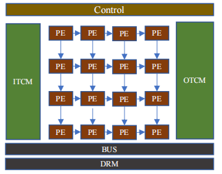
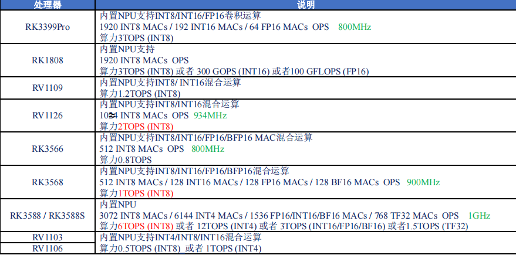
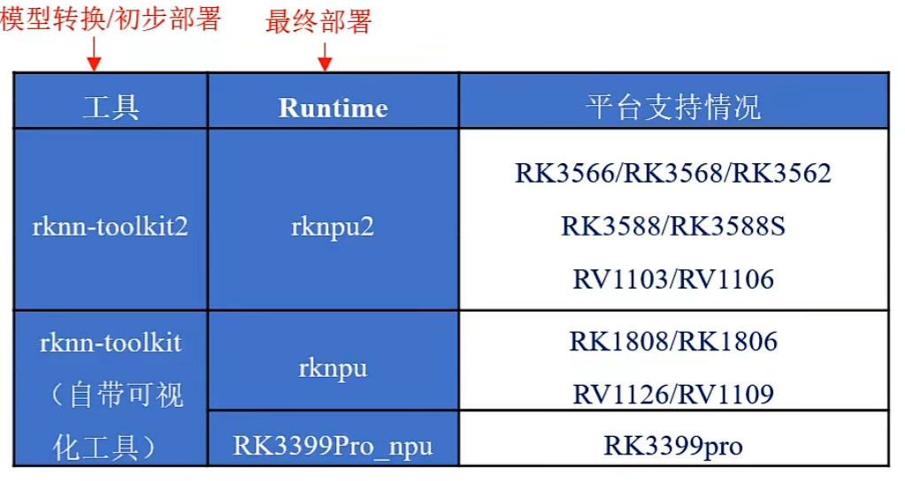
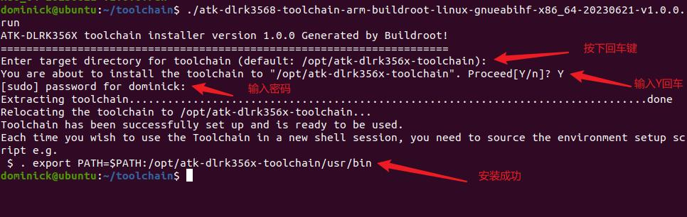

瑞芯微部署(RK3568)
===

# NPU概念

NPU（Neural Process Unit，神经网络处理单元），也称AI处理器，通过电路层来模拟人类的神经元和突触结构，通过深度学习指
令集直接处理大规模神经元和突触，通过一条指令即可完成一组神经元的处理，执行效率更高。
NPU采用数据驱动并行计算架构，可同时处理多批次高维数据，可以同时执行多个矩阵乘法操作，适合处理视频、图像类的海量
数据，可用于加速神经网络运算。
NPU具有功耗低、计算性能强、效率高、成本低、体积小等特点。
# 不同芯片算力比较


# 不同RK工具包支持情况

---
# 1. ADB安装
1. 计算机端下载adb安装包
地址:https://developer.android.google.cn/studio/releases/platform-tools
2. unzip 安装包
```
unzip platform-tools_rxx.x.x-linux.zip
```
3. 添加Path环境变量
```
export PATH=$PATH:~/tools/platform-tools (该设置方式只是临时的，将该命令加到 ~/.bashrc文件中用永久生效)
```
4. 测试
```
adb version
```
# 2. 计算机端 安装交叉编译工具
```
1. 将 资 料 盘 “ 开 发 板 光 盘 A 盘 - 基 础 资 料 → 05 、 开 发 工 具 → 交 叉 编 译 工 具 →
    atk-dlrk3568-toolchain-arm-buildroot-linux-gnueabihf-x86_64-20230621-v1.0.0.run”
    拷贝到 ubuntu 里面任意目录下

2. 开启权限
chmod a+x atk-dlrk3568-toolchain-arm-buildroot-linux-gnueabihf-x86_64-20230621-v1.0.0.run

3. 安装交叉编译工具链
./atk-dlrk3568-toolchain-arm-buildroot-linux-gnueabihf-x86_64-20230621-v1.0.0.run

4. (需要时)卸载交叉编译工具链
打开 ubuntu 的终端进入到/opt 目录下上执行 ls 可以看到安装好的交叉编译工具链文件夹，执行以下命令进行删除。
sudo rm -rf atk-dlrk356x-toolchain/
```

# 3. 计算机端rknn-toolklt2安装
1. 新建 Projects项目 文件夹

```
mkdir Projects
```
2. 进入该目录
```
cd Projects
```
3. 下载 RKNN-Toolkit2 仓库
```
git clone https://github.com/airockchip/rknn-toolkit2.git --depth 1
```
4. 下载 RKNN Model Zoo 仓库
```
git clone https://github.com/airockchip/rknn_model_zoo.git --depth 1
```
5. 注意：
    1. 1.参数 --depth 1 表示只克隆最近一次 commit
    2. 2.如果遇到 git clone 失败的情况，也可以直接在 github 中下载压缩包到本地，然后
    解压至该目录
6. 新建conda环境
    ```
    conda create -n toolkit2 python=3.8
    进入conda环境
    conda activate toolkit2 
    ```
7. 进入 rknn-toolkit2 目录
    ```
    cd Projects/rknn-toolkit2/rknn-toolkit2
    ```
8. 请根据不同的 python 版本，选择不同的 requirements 文件 ,例如 python3.8 对应 requirements_cp38.txt 
    ```
    pip install -r doc/requirements_cpxx.txt
    ```
9. 安装 RKNN-Toolkit2
        1. 请根据不同的 python 版本及处理器架构，选择不同的 wheel 安装包文件：
        2. 其中 x.x.x 是 RKNN-Toolkit2 版本号，xxxxxxxx 是提交号，cpxx 是 python 版本号，请根据实际数值进行替换
    ```
    pip install packages/rknn_toolkit2-x.x.x+xxxxxxxx-cpxx-cpxxlinux_x86_64.whl
    ```
10. 测试是否安装成功
    ```
    # 进入 Python 交互模式
    python
    # 导入 RKNN 类
    from rknn.api import RKNN
    ```

# 4. 更新开发板终端npu
- 注意usb需要连接**OTG**端口
1. 计算机端clone rknpu2项目
```
git clone   https://github.com/rockchip-linux/rknpu2
```
2. 将两个目录的文件传到板端
```
# 传送文件
adb push runtime/RK356X/Linux/librknn_api/aarch64/librknnrt.so /usr/lib
adb push runtime/RK356X/Linux/rknn_server/aarch64/usr/bin/* /usr/bin

# 进入板端shell给予权限，并重启服务
adb shell
chmod +x /usr/bin/rknn_server
chmod +x /usr/bin/start_rknn.sh
chmod +x /usr/bin/restart_rknn.sh
restart_rknn.sh

# 执行以下命令查询 rknn_server 版本
strings /usr/bin/rknn_server | grep build

#  执行以下命令查询 librknnrt.so 版本
strings /usr/lib/librknnrt.so | grep version
```

# 5. 开发板终端 RKNN Toolkit Lite2 安装
```
1. 计算机端进到 rknn-toolkit2-1.5.0/rknn_toolkit_lite2/packages 目录
2. 计算机端运行 adb push rknn_toolkit_lite2-1.5.0-cp38-cp38-linux_aarch64.whl /userdata 发送文件
3. 板端 cd /userdata
4. 板端 pip install rknn_toolkit_lite2-1.5.0-cp38-cp38-linux_aarch64.whl
```

# 6.测试 python 下的 AI 例程
```
1. 发送测试文件
adb push examples/inference_with_lite/ /userdata
2. 在板端进入文件测试
cd /userdata/inference_with_lite/
python test.py
```

# 7. scrfd人脸及关键点识别python代码测试
```
1. 发送ai源码11到板端
adb push 11_facedet_scrfd_npu/ /userdata/aidemo
2. adb shell进入板端，然后进入源码文件夹
cd /userdata/aidemo/11_facedet_scrfd_npu
3. 运行main.py 文件测试
python main.py
```

# 8. yolov5 c++部署测试
```
注意：确保安装了交叉编译器（计算机端）和更新npu服务（板端）
1. 计算机端解压rknn_yolov5_demo.zip文件
unzip rknn_yolov5_demo.zip
2. 进入demo文件夹
cd rknn_yolov5_demo
3. 计算机端编译程序
./build-linux_RK356X.sh
4. 将install文件夹内的atk_rknn_yolo_v5_demo发送到板端
adb push install/atk_rknn_yolo_v5_demo/ /userdata/aidemo
5. 进入板端的atk_rknn_yolo_v5_demo文件夹
cd /userdata/aidemo/atk_rknn_yolo_v5_demo/
6. 进行测试
./rknn_yolo_demo yolov5 fp ./model/yolov5s_relu_tk2_RK356X_i8.rknn ./model/RK_anchors_yolov5.txt
```
- 经测试推理时间在**80ms**左右
- 该c++代码可以作为后续开发基础模板（文件路径 "【正点原子】RK3568开发板资料（A盘）-基础资料\01、程序源码\01、AI例程\01、源码\06_yolov5"）

## 9. rknn_model_zoo PPOCR部署
1. 终端进入RKNN_MODEL_ZOO
2. 下载onnx模型并将onnx模型转换成rknn模型
```
# 注意：需要进入rknn环境
# 下载onnx模型
cd model
./download_model.sh

# 转换成rknn模型
cd python
python convert.py <onnx_model> <TARGET_PLATFORM> <dtype(optional)> <output_rknn_path(optional)>
# such as: python convert.py ../model/ppocrv4_det.onnx rk3566

# output model will be saved as ../model/ppocrv4_det.rknn
```
3. 主机设置环境变量(重要影响下一步的编译)
```
# 该路径为安装rknn交叉编译工具时候的opt路径
export GCC_COMPILER=/opt/tools/prebuilts/gcc/linux-x86/aarch64/gcc-linaro-6.3.1-2017.05-x86_64_aarch64-linux-gnu/bin/aarch64-linux-gnu
# rk3568参考 export GCC_COMPILER=/opt/tools/atk-dlrk356x-toolchain/usr/bin/aarch64-buildroot-linux-gnu
```
4. 编译
```
# 编译完成会在install文件夹生成
./build-linux.sh  -t <TARGET_PLATFORM> -a aarch64 -d PPOCR-Det
```
5. 将install的编译文件推送到板端
```
adb push install/<TARGET_PLATFORM>_linux_aarch64/rknn_PPOCR-Det_demo /userdata/
```
6. 进入板端，在板端设置动态库路径，并测试
```
adb shell
cd /data/rknn_PPOCR-Det_demo

export LD_LIBRARY_PATH=./lib
# 推理测试
./rknn_ppocr_det_demo model/ppocrv4_det.rknn model/test.jpg
```
7. 结果
当文字相交或者完全包含的情况下，检测结果存在较大问题

