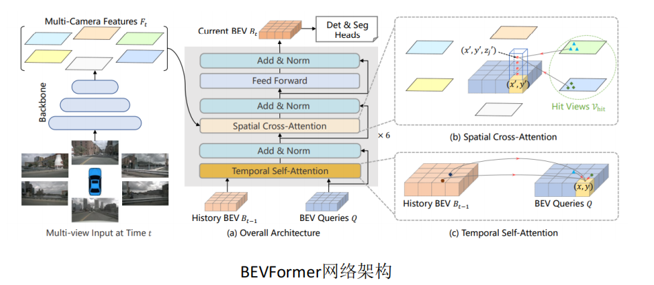
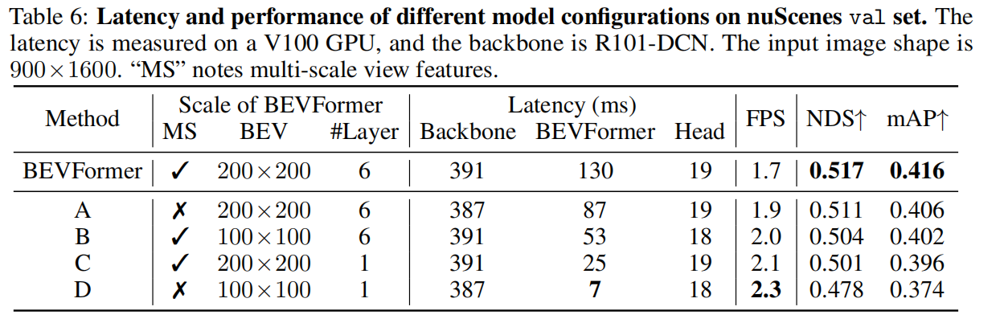

BEVformer
===

# 论文总结

## 主要贡献
1. 构建稠密BEV表征，加入时序特征
## 消融实验
1. spatial cross-attention不同范围内的对比结果
   
   - 在local范围的内的attention是性能最好的
2. 不同bev grid大小以及layer数量对比
   
   - 在降低bev grid大小以及减少layer数量均对nds和map有较大影响