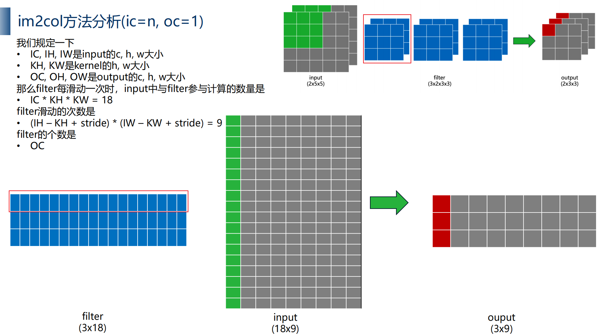

CUDA-BEVFUSION
- 根据 BEVFusion: Multi-Task Multi-Sensor Fusion with Unified Bird's-Eye View Representation 进行cuda加速的
- git：https://github.com/NVIDIA-AI-IOT/Lidar_AI_Solution/tree/master/CUDA-BEVFusion

===
# 整体优化方向（整体使用FP16）
1. Camera Encoder: 
    • 一系列前处理(Normalization, resize这些)，*使用CUDA加速*
    • 可支持int8量化(这里的推理时间比重最大)。*使用TensorRT加速*
2. LiDAR Encoder: 
    • 设计voxelization的CUDA kernel，加速points到voxel的转换。*使用CUDA加速*
    • 自定义spconv的实现，做SCN的前向推理(*这里估计没有走TensorRT，而是使用CUDA加速，因为lidar每帧输入数量都是不一样的*)
3. Camera-to-BEV
    • 自定义BEVPool的CUDA kernel，加速camera feature->BEV feature的转换。*使用CUDA加速*
    • BEVPool后的BEV feature在通过几个conv进行特征提取。*使用TensorRT加速*
4. LiDAR-to-BEV
    • SCN之后的feature就是BEV级别的feature了，所以这里属于LiDAR Encoder的一部分
5. BEV Encoder
    • 属于fusion的部分。*这里可支持int8量化*
    • 通过几个conv进行融合后的特征提取。*使用TensorRT加速*
6. Head
    • 将BEVFeature转换到output能够用的feature。*使用TensorRT加速*
    • 将拿到的output feature进行decode与绘图。*使用CUDA加速*
- conv 大部分可以用TensorRT加速
# 测试环境
- ubuntu 20.04
- python=3.8
- cuda=11.1
- TensorRT=8.5.1
- torch=1.10.1
- libprotobuf-dev（一定要3.6.1 ubuntu 20.04->直接apt install 安装即可；22.04需要git clone下来切换到3.6.x 安装）
    - git clone 源码安装进行以下测试 
        - protoc --version
        - pkg-config --libs protobuf
## 配置环境 
- 修改 tool/environment.sh
    - 修改TensorRT 路径
    - 修改CUDA 路径
    - 执行 bash tool/environment.sh 
- 注意：如果cuda版本较低不支持当前GPU的算力
    - 需要在 CUDASM 降低算力，cuda11.1 仅支持80
        -  
    - 或者升级cuda
## 创建引擎
- bash tool/build_trt_engine.sh
## 编译/推理
- bash too/run.sh
会显示如下结果

- 结果


# Sparse Convolution
- 核心代码：https://github.com/tianweiy/CenterPoint/blob/master/det3d/models/backbones/scn.py
## 原理
### 稀疏的点云数据
- 整体进行计算的话，会存在很多无效计算，所以为0的点可以直接skip

### rulebook
- 分别记录
    - (i,j) kernel的offset，即kernel要进行计算的位置
    - count 同一kernel位置当前进行第几次计算
    - v_in  点云index—>可获取当前点云位置
    - v_out 输出对应index->可获取输出位置
- 建立好rulebook后就可以进行*dense的并行计算*了

## 导出带有scn的onnx
- 参考：https://github.com/NVIDIA-AI-IOT/Lidar_AI_Solution/tree/master/libraries/3DSparseConvolution
- [重要代码](./%E5%AF%BC%E5%87%BAscn2onnx.py)

### 通过hook重定位
```
#核心部分
#通过该函数将让pytorch在forward时候，如果遇到指定的某一类forward，在执行完forward以后跳转到自定义的函数里面，执行onnx.helper.make_node，从而创建onnx
def register_node(fn):

    fnnames   = fn.split(".")
    fn_module = eval(".".join(fnnames[:-1]))
    fn_name   = fnnames[-1]
    oldfn = getattr(fn_module, fn_name)
    
    def make_hook(bind_fn):

        ilayer = 0
        def internal_forward(self, *args):
            global enable_trace

            if not enable_trace:
                return oldfn(self, *args)

            global avoid_reuse_container
            nonlocal ilayer

            # Use the enable_trace flag to avoid internal trace calls
            enable_trace = False
            y = oldfn(self, *args)
            bind_fn(self, ilayer, y, *args)
            enable_trace = True

            avoid_reuse_container.extend(list(args) + [y]) 
            ilayer += 1
            return y

        setattr(fn_module, fn_name, internal_forward) #主要是通过这个函数实现，调用 fn_module.fn_name 就会触发 internal_forward
    return make_hook

# 在这里进行注册
@register_node("torch.nn.ReLU.forward")
def symbolic_relu(self, ilayer, y, x):
    register_tensor(y)
    print(f"   --> ReLU{ilayer} -> Input {get_tensor_id(x)}, Output {get_tensor_id(y)}")

    nodes.append(
        helper.make_node(
            "Relu", [get_tensor_id(x)], [get_tensor_id(y)], f"relu{ilayer}"
        )
    )
```
## spconv优化（Explicit GEMM conv）
### im2col
- 将weight 和 input 展开成2D,再进行矩阵乘法（显性：但是会需要分配额外的空间，占用更多显存）

- 多个filter的情况

### spconv 使用 Explicit GEMM conv
- git repository：https://github.com/traveller59/spconv

- 优点: 加速稀疏卷积
- 缺点：需要额外分配空间、增加不比要的memory R/W
## spconv优化（Implicit GEMM conv）
- 不像Explicit分配额外的空间，跳过im2con而通过索引的方式实现
- 跟scn的rulebook是有点类似的

### 优化
1. 使用tilling
2. 结合硬件合理调整grid size和block size
3. warpGEMM加速
4. 使用shared memory
5. 更改shared memory上的data layout来避免bank conflict
6. 更改global meory上的data layout来实现合并访存
7. 预处理偏移量来删除除法和求余
8. 通过wmma调用Tensor Core
9. 使用CUTLASS(*)
# BEVPool
1. 将camera feature和depth feather*外积*，得到camera feature point cloud(相机像素视角下带有深度的伪点云)，维度是[N, D, H, W, C]
2. 将camera feature point cloud里的所有点project到*BEV grid*里(对于越界的不投影):lidar坐标->自车坐标系->世界坐标系->自车坐标系->相机坐标系->image坐标系
3. 将一个BEV grid里的所有点进行相加
4. 最终得到[1, C, BH, BW]维度的BEV feature，可以用于后续处理
- 该部分不做优化直接推理的话，整体600ms，BEVPool就耗时约500ms
## 优化策略
### Precomputation
- camera feature point cloud 到 BEV grid ，提前计算映射关系，即上述第2点
### Interval Reduction
- 每个bev grid分配一个tread负责将分配到该grid内feature进行相加，即上述第3点
# CUDA-BEVFusion中的各个onnx

# CUDA-BEVFusion推理框架设计
- RAII:Resource Acquisition Is Initialization
1. 实现类
2. 接口类（hpp部分代码）
3. 命名空间

# 代码分析
### [lidar_voxelization](./code/voxelization.cu#L235-L269)
- 用*160000的voxel(1440*1440*40)*承接最多*300000的点*，每个voxel最多10个点
- 输出lidarfeature=160000*10*5   
    - 160000个voxel，最多10个有效点，5个feature ； 
    - 由于只取各个voxel的有效点的平均值且转换成连续空间，lidarfeature 表现为前n个位有效点，后 160000*10 - n 个为无效点
### scn
- 稀疏点云卷积该部分未开源 
- 可参考CenterPoint的scn代码： https://github.com/tianweiy/CenterPoint/blob/master/det3d/models/backbones/scn.py
### [camera_depth]
### [camera_BEVPool]
### [liadar_BEVPool]
### [Fusion]
- camera bev feature 和 lidar bev feature 融合

