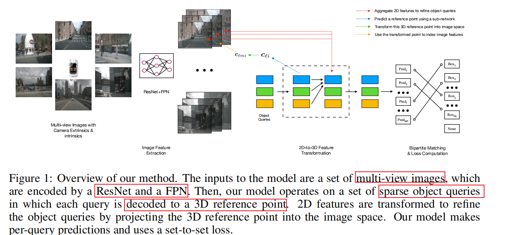
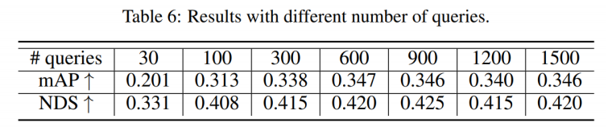
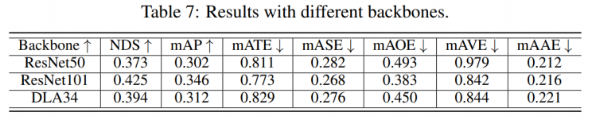

DERT3D
===

# 论文总结

## 主要贡献
1. 以稀疏的向量构建与表示3D空间,用3D object queries作为一种leanable ”anchor”负责目标检测
### 重点结构
1. Iterative bounding box estimates

- 步骤
    1. Self-attention 建模queries间全局特征交互
    2. Cross attention: 采样图像特征
       1. 2D-to-3D feature transformation
       2. 构建queries表示的稀疏BEV特征
    3. queries用于预测目标属性
    4. 进入下一个layer重复上述步骤
## 消融实验
1. 不同数量query对比
   
   - 在queries到达600的时候map和nds无明显提升
2. 不同backborn对比结果
    
    使用ResNet101的NDS和mAP性能最佳