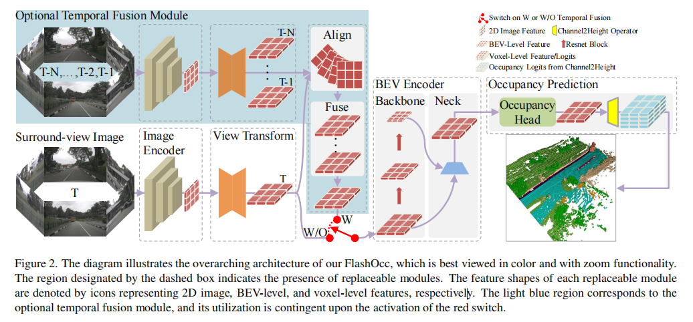
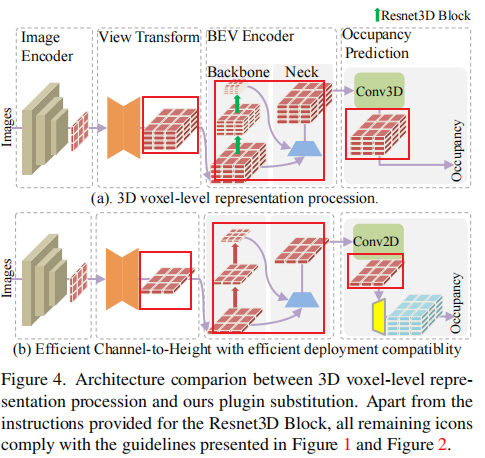
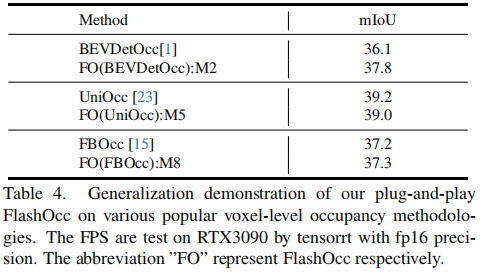
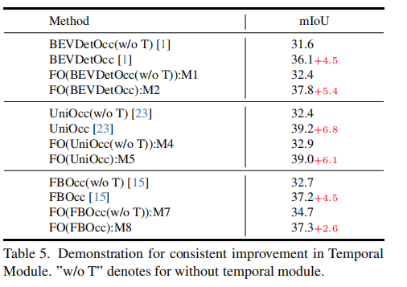
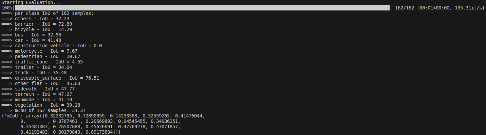
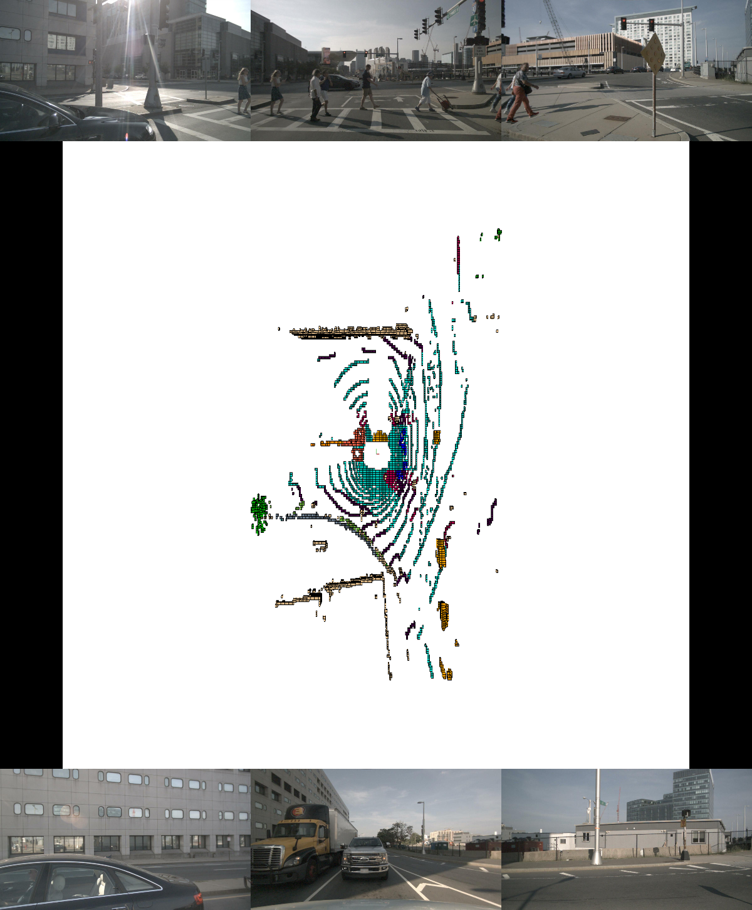
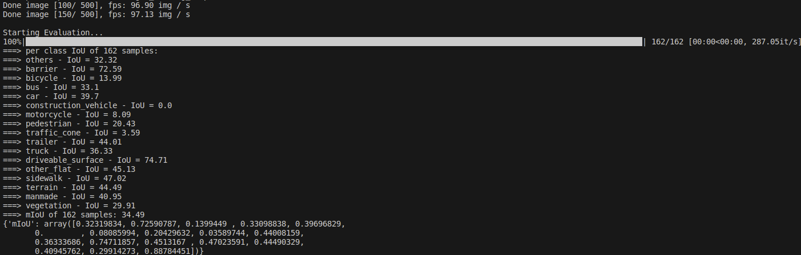
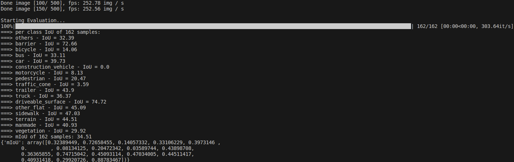
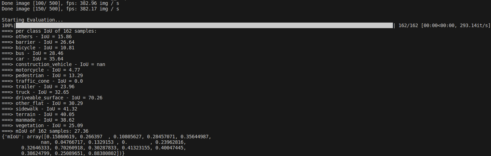

FlashOCC
===

- 支持范围
    - 前后左右 [-40m - 40m]
    - 上下     [-1m - 5.4m]
- 模型主要有以下几个部分
(1) *image encoder*:A 2D image encoder responsible for extracting image features from multi-camera images. (采用resnet|swin)
(2) *2d to 3d bev*:A view transformation module that facilitates the mapping from 2D perceptive-view image features into 3D BEV representation.（采用lss的方式）
(3) *bev encoder*:A BEV encoder tasked with processing the BEV feature information（fpn的的方式）
(4) *occ head*:Occupancy prediction module that predicts segmentation label for each voxel. 
(5) *temporal fusion*:An optional temporal fusion module designed to integrate historical information for improved performance
# 论文总结
## 主要贡献
1. Channel-to-Height transformation：在occ head部分使用
    - 基于sub-pixel convolution layer 应用于超分和 BEV segmentation（Petrv2）作者提出了Channel-to-Height transformation
        - 直接用扁平的bevfeature进行occ预测，输入bev channel直接当成[分类数量 x 高度z]
        - 简单的将B × C × W × H 转成 B × C∗ × Z × W × H,C = C∗ × Z
            - B batch size
            - W  x
            - H  y
            - Z  z
            - C∗ class number
## 消融实验
1. 是否使用flashocc框架的区别
    - 整体框架变动
        - 替换3Dconv 为 2D conv
        - lss的输出z维度减少为1
        - head部分z维度也减少为1
        
    - miou变化不大，说明2dconv完全是足够的
        
2.是否加入时序
- 说明框架变动后不会削弱时序信息对预测结果的促进作用

### 耗时
1.BEVDetOcc 使用flashocc后耗时的减少
- BEVencoder 减少58.7%
- occhead 从7.3ms减少到3.1ms
- memory  从398MiB减少到124MiB
# 复现
- 环境
    - ubuntu 20.04
    - python=3.8
    - cuda=12.0
    - TensorRT=8.5.1
    - torch=1.10.1
    - onnxruntime_gpu=1.8.1
    - mmcv-full=1.5.3
    - mmdeploy=0.9.0
    - mmdet=2.25.1
    - mmdet3d=1.0.0rc4
    - mmsegmentation=0.25.0
    - 4090 24G*2
## train结果
## eval结果

- occ结果比SurroundOcc稀疏很多

## mmdeploy TensorRT 测试结果
### FP32
FPS:97.13

### FP16
FPS:252.56

### INT8
FPS:382.17
miou下降较多

## 使用稠密occgt训练
- 数据集构建参考SurroundOcc