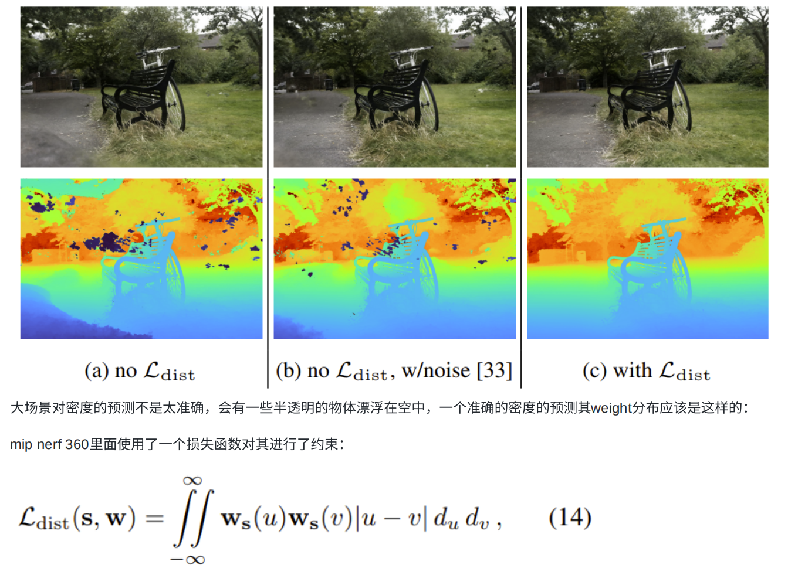

Mip-NeRF 360
===
# 主要贡献
1. 解决了Mip-Nerf不能很好⽤于360度⽆边界场景渲染的问题;
    1. 差异采样
    2. 重参数化
2. 解决了采样效率低的问题;
    1. 增加Lprop
3. 解决了密度构建中的结构不准确问题，存在半透明漂浮物。
    1. 增加dist损失函数约束，使weight只在某一区间比较大
        - 为使Ldist比较小，需要满足以下条件
            - 当u-v比较大的时候，w(u)或w(v)需要为0
            - 当w(u)、w(v)比较大的时候，u-v 就需要比较小
    