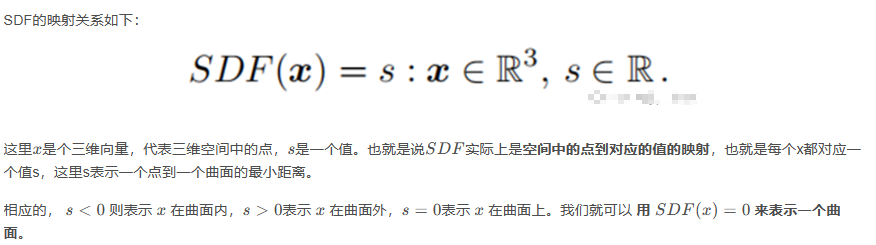
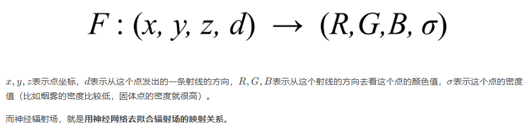
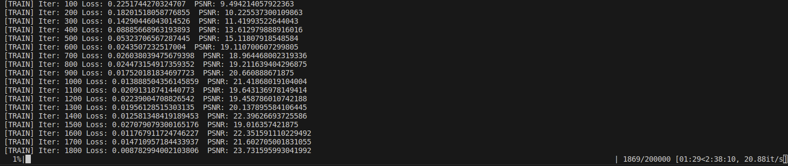

NERF
===
# 相关知识
1. SDF(Signed Distance Funciton)
SDF表示一个点到一个曲面的最小距离，同时用正负来区分点在曲面内外。点在曲面内部则规定距离为负值，点在曲面外部则规定距离为正值，点在曲面上则距离为0.

2. Occupancy Field
占用场就是 “空间中的点”到“点是否被曲面占用的概率”的映射， 占用场给空间中每个点都赋一个是否被曲面占用的概率，相当于表示了一个点在曲面内部的概率
3. Neural Radiance field（surface light field）
辐射场 Radiance Field 就是将“空间中的点+点发出的一条射线”映射到“点的密度值+射线的方向对应的颜色值

    - 光照和形状结合起来
    1. rays生成
        - rays数据结构:5D(x,y,z,θ,φ)位置+方向
        - rays生成策略
        - rays数量
    2.  volume rendre（体渲染）
        - 密度
        - 颜色吸收能力
        - 剩余光强

# 复现
- 环境
    - ubuntu 20.04
    - python=3.8
    - cuda=11.3
    - torch=1.11.0 
    - torchvision=0.12.0
    - 4090 24G
- 耗时：3hours

- 结果
[video](./picture/blender_paper_lego_spiral_200000_rgb.mp4)
