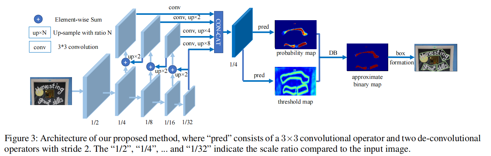
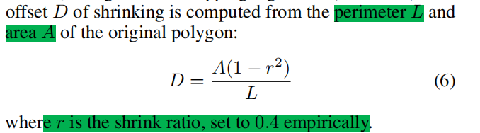
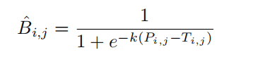
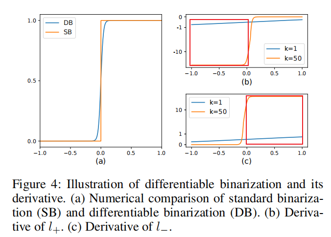
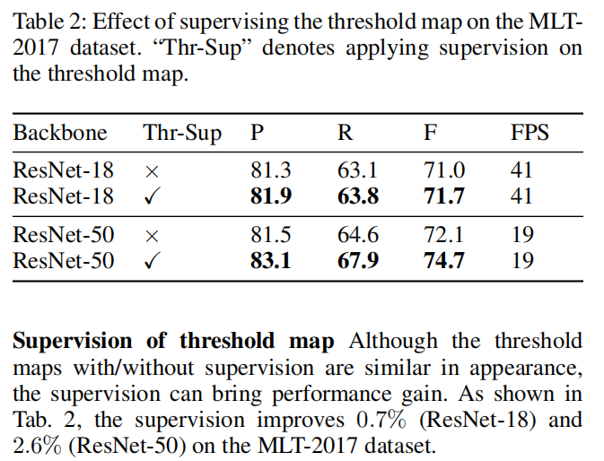
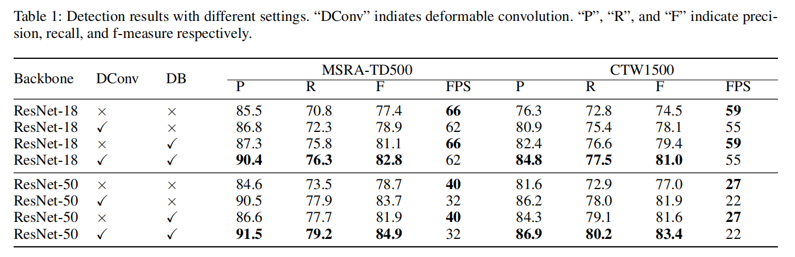

DBNET
===

# 创新点
1. probability map：
   构建Label generation时搜索gt框，保证训练过程中的召回率
   
2. threshold map：辅助学习文本框的边界
3. Differentiable binarization
   
   - B 近似二分图
     - P 概率图
     - T 阈值图
     - 优点：可微性质，带来性能提升
        
        （b）所示positive labels时，令P-T为x，当x<0(即预测错的时候)，可看出设置k=50的梯度明显比k=1时的梯度更大;
        （c）为negative labels时，亦同理，可以加快模型优化。
4. 可以检测弯曲的文字
# 缺陷
1. 无法很好检测相交和完全包含的文字
```
原文：One limitation of our method is that it can not deal with
cases “text inside text”, which means that a text instance
is inside another text instance. Although the shrunk text regions are helpful to the cases that the text instance is not in
the center region of another text instance, it fails when the
text instance exactly locates in the center region of another
text instance. This is a common limitation for segmentationbased scene text detectors.
```
# 消融实验
1. threshold map带来的提升
   - resnet-50带来的提升明显一点
    
2. DB算法提升
   - DB算法带来的提升幅度大于DConv
   - DB算法不会降低fps
   