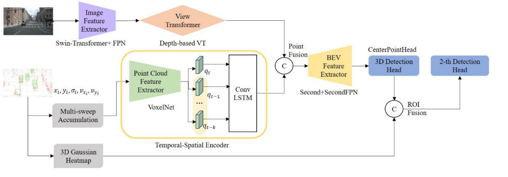
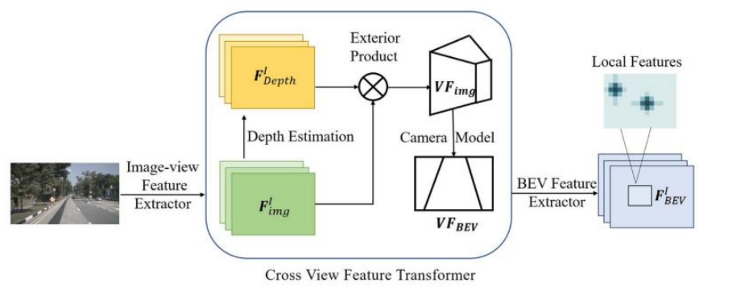
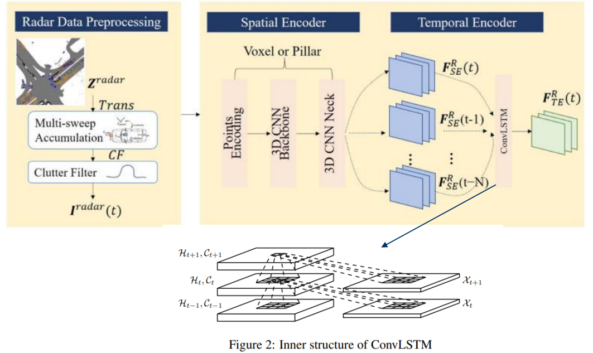
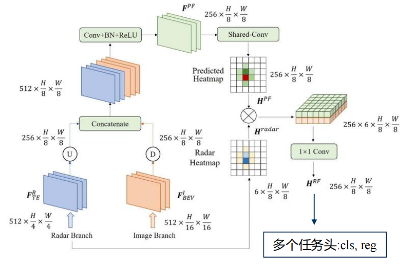

RCBEV:Bridging the View Disparity of Radar and Camera Features for Multi-modal Fusion 3D Object Detection
===

# 主要贡献
1. 提出一种双阶段融合3D检测网络(Point Fusion & ROI Fusion)
2. 使用Temporal Spatial Encoder(ConvLSTM)处理多帧雷达时序信息
3. 跨视角融合特征
   
# 输入
1. 解决稀疏性问题
   - 多帧点云对齐到当前帧(10 sweeps)
- 输入:
  1. 雷达点云：(x, y, RCS, velocity_comp)  
    - RCS:雷达散射截面（Radar Cross section，缩写RCS）是度量目标在雷达波照射下所产生回波强度的一种物理量
  2. 环视图像(6 camera)

# image部分

1. 使用lss的方式将图像进行深度扩展，生成frustum
2. 将frustum转换到bev视角下

# Radar 部分

1. 增加时序部分，用于融合前N帧的radar feature
# Fusion Layer部分

1. point fusion
   - 过程：
      1. 上采样雷达特征并concate图像BEV特征
      2. Conv + BN + ReLU
      3. 得到融合特征
      4. 预测heatmap
2. ROI fusion($H^{pe}\times H^{radar}$ 部分)
   - 作用：使用radar的数据对concat后的数据进行attention
   - 过程：
     1. radar feature 和 concat feature 外积生成heatmap
     2. 1x1卷积合并通道
     3. 多任务头预测