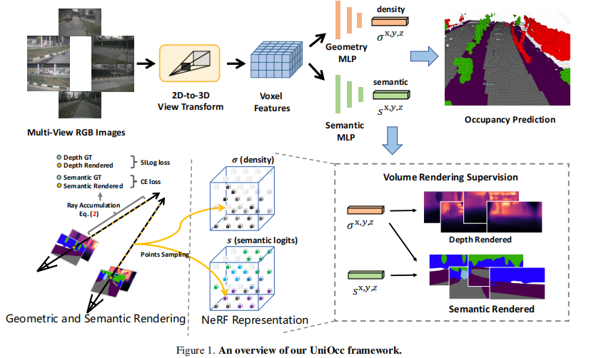
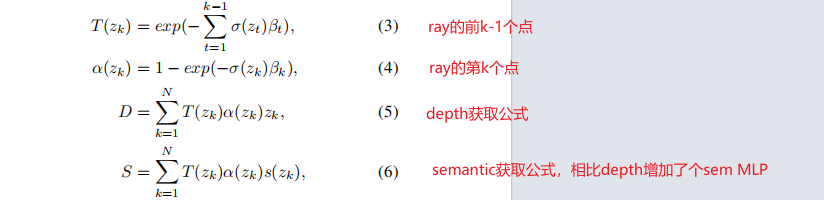
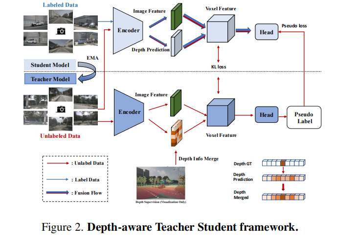
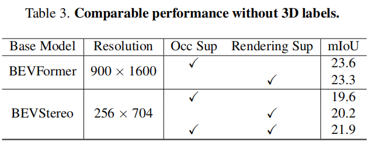
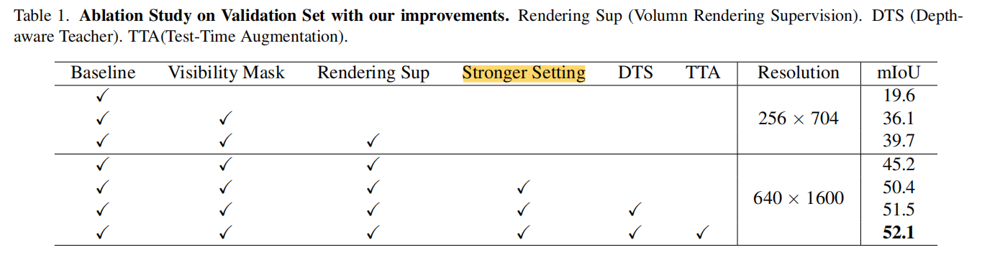
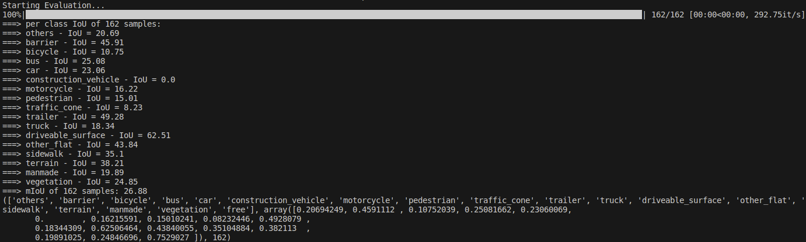
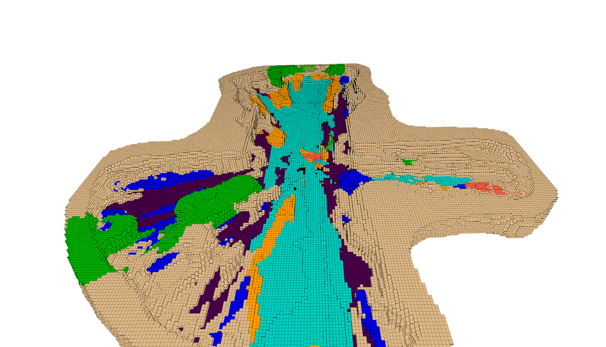

UniOcc
- 缓解对3Docc标注的依赖：增加2D的深度图和分割图（通过SAM或者Visionllm获取）监督3D occ的生成，*有减少3D分割标注的巨大潜力*
=== 

# 论文总结
## 主要贡献
1. Volumn Rendering Supervision
    - 使用体渲染的方式生成depth和semantic
    - 参考：Mip-NeRF 360 
    - 公式
    和体渲染公式基本一致
    
    - 输出输入voxel_feats
        - shape：bnwhdc
    - 输出
        1. geometric rendering
            Scale-Invariant Logarithmic (SILog) loss
        2. semantic rendering
            cross-entropy loss
    - 问题
        - ray数量如何确定
        - ray上如何采样
2. Depth-aware Teacher Student(DTS) 
    - 半监督方法,用于充分利用未标注的数据
    - 使用学生模型的ema更新教师模型的参数
    - 结合真实的激光雷达深度投影
    
## 消融实验
-  visibility mask、Rendering Sup 和 Stronger Setting 对MIOU提升较多
    - visibility mask（正常的数据增强）
    - Rendering Sup（上述体渲染深度和分割监督）
    - Stronger Setting包含
        1. replaced the 2D backbone with ConvNeXt-Base
        2. utilizedstronger pretrain models
        3. increased voxel feature channels
        4. improved the 3D voxel resolution
- 不使用occlabel，仅使用Rendering Sup也能获得差不多的结果（重点）
    - 说明该方法有巨大潜力
    

# 复现
- 环境
    - ubuntu 20.04
    - python=3.8
    - cuda=11.1
    - TensorRT=8.5.1
    - torch=1.10.1 
    - torchvision=0.11.2
    - mmcv-full=1.6.0
    - mmdet3d=1.0.0rc4
    - mmdet=2.24.0 
    - mmsegmentation=0.24.0
    - 4090 24G
## eval结果
- 当前给到的预训练版本噪声比较过，但是occ很稠密


## 重新训练结果
- 6分钟/epoch
- 存在问题：
    1. 64G的内存会用完，进程直接就被杀死了，单卡多卡训练均存在该问题
        - 内存不够的话，可以设置分批训练了:修改pkl文件分成两批训练
            - 该项目测试不是这个问题
        - 也有可能是workers_per_gpu设置太高：可以相应调低
            - 该项目测试不是这个问题
        - 应该是项目内哪里代码存在问题
            - 暂时不确定是哪里

    2. cuda11.1 torch1.10.1+cu111下cuda数据的 torch.inverse()会报错报错
        - 测试下只有在torch1.12.1下才能使用cuda数据的 torch.inverse()
            - 但是mmcv就又会报错了
    3. 最终还是用回torch1.10.1, 切换成其他版本问题就更多了
        - 使用torch.inverse(data.cpu()).cuda()暂时解决 
    4. 单卡debug的时候会报错，process group hasnot been initialized
        - 需要把configs/renderocc/bevstereo-occ.py配置文件的以下代码注释
        ```
        dict(
            type='SyncbnControlHook',
            syncbn_start_epoch=0,
        ),
        ```
## 代码分析
### nerf_head
- 过程
    1. rays获取
    2. rays sample
    3. 获取α（吸收能力）和T（剩余光线强度）
    4. 计算render depth 和render semantic loss
- [code增加注释](./code/mmdet3d/models/nerf/nerf_head.py#L307)

- 算子输入输出不定的时候可参考以下方式
[自定义算子可参考(调用)](./code/mmdet3d/models/nerf/nerf_head.py#L221)
[自定义算子可参考(forward&backward)](./code/mmdet3d/models/nerf/utils.py#L26)
[自定义算子可参考(cuda)](./code/mmdet3d/models/nerf/cuda/render_utils_kernel.cu#L460)


## 使用稠密occ数据训练上