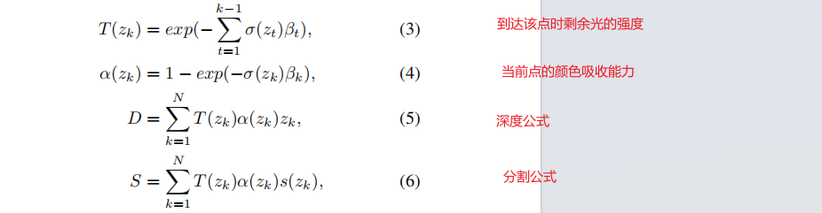

UniOcc
- 缓解对3Docc标注的依赖：增加2D的深度图和分割图（通过SAM或者Visionllm获取）监督3D occ的生成，*有减少3D分割标注的巨大潜力*
=== 

# 论文总结
## 主要贡献
1. Volumn Rendering Supervision
    - 参考：Mip-NeRF 360 
    - 公式
    和体渲染公式一致
    
    - 输出输入voxel_feats
        - shape：bnwhdc
    - 输出
        1. geometric rendering
            Scale-Invariant Logarithmic (SILog) loss
        2. semantic rendering
            cross-entropy loss
    - 问题
        - ray数量如何确定
        - ray上如何采样
2. Depth-aware Teacher Student(DTS) framework

# 复现
- 环境
    - ubuntu 20.04
    - python=3.8
    - cuda=11.1
    - TensorRT=8.5.1
    - torch=1.10.1 
    - torchvision=0.11.2
    - mmcv-full=1.6.0
    - mmdet3d=1.0.0rc4
    - mmdet=2.24.0 
    - mmsegmentation=0.24.0
    - 4090 24G
## eval结果
- 当前给到的预训练版本噪声比较过，但是occ很稠密

  
## 重新训练结果
- 6分钟/epoch
- 存在问题：
    - 64G的内存会用完，进程直接就被杀死了
    - cuda11.1 torch1.10.1+cu111下cuda数据的 torch.inverse()会报错报错
        - 测试下只有在torch1.12.1下才能使用cuda数据的 torch.inverse()
            - 但是mmcv就又会报错了

## 使用稠密occ数据训练上