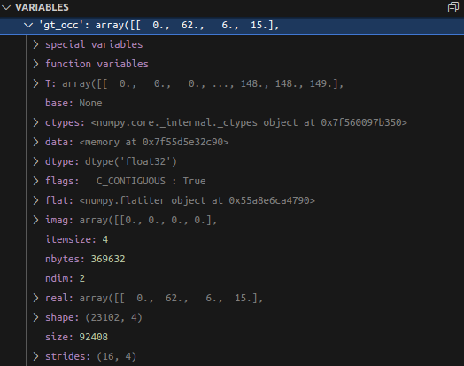
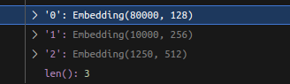
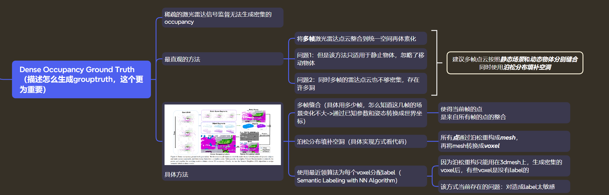
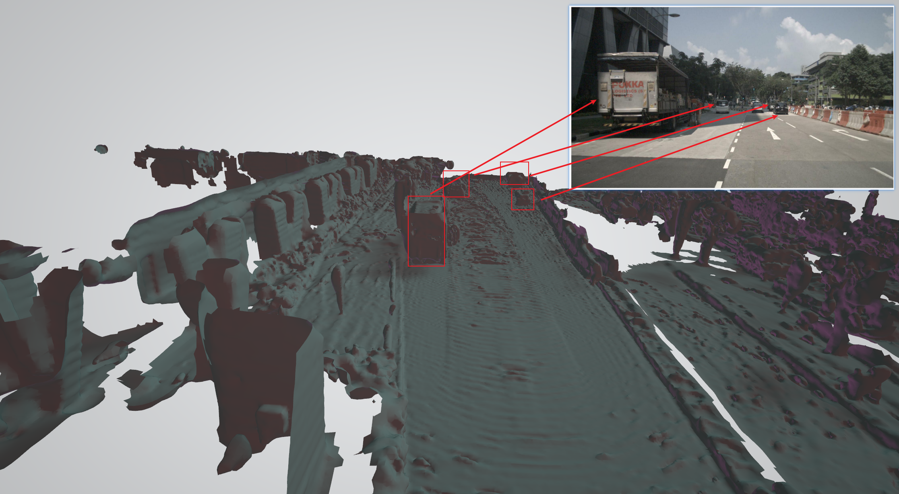

Surroundocc
===
# 论文内容初步整理
[xmimd](./Surround.xmind)

- 支持范围
    - 前后左右 [-50m - 50m]
    - 上下     [-5m - 3m]
# 复现
开源代码：https://github.com/weiyithu/SurroundOcc/tree/main
- 最好在linux中复现，windows会存在较多问题
## 环境
- ubuntu 20.04
- python=3.7
- cuda=11.1
- TensorRT=8.5.1
- torch=1.10.1
- 4090 24G*2
### 注意
- 如果gcc已经大于5的话，就不要再执行以下命令了，避免其他问题
```
conda install -c omgarcia gcc-6 # gcc-6.2
```
## trian
1. 训练过程
    
    - 显存占用
    

2. GT数据结构

```
数据格式
[[x,y,z,class]...]
```
3. 使用nusecnes 训练
4. sample=1 24G显存基本占满,偶尔会出现outmemory
5. 问题
    - occ label generation
        - 问题 attribute error: 'open3d.open3d.geometry.PointCloud' has no attribute 'estimate_normals'

# 代码重点部分
## head
### 2D featire tO 3D feature 和 3Ddecoer
- 使用transformer将2dfeature转到3d空间中
- query如下,对应config->surroundocc.py下的volume配置


```
# 80000 =  100*100*8 第一层的的h*w*z参数
# 128 embedding_dim
volume_h_ = [100, 50, 25]
volume_w_ = [100, 50, 25]
volume_z_ = [8, 4, 2]
```
```
#路径 projects/mmdet3d_plugin/surroundocc/dense_heads/occ_head.py
@auto_fp16(apply_to=('mlvl_feats'))
def forward(self, mlvl_feats, img_metas):

    bs, num_cam, _, _, _ = mlvl_feats[0].shape
    dtype = mlvl_feats[0].dtype

    volume_embed = []
    for i in range(self.fpn_level): ### 将2dfeature转成3dfeature
        volume_queries = self.volume_embedding[i].weight.to(dtype)
        
        volume_h = self.volume_h[i]
        volume_w = self.volume_w[i]
        volume_z = self.volume_z[i]

        _, _, C, H, W = mlvl_feats[i].shape
        view_features = self.transfer_conv[i](mlvl_feats[i].reshape(bs*num_cam, C, H, W)).reshape(bs, num_cam, -1, H, W)

        volume_embed_i = self.transformer[i](
            [view_features],
            volume_queries,
            volume_h=volume_h,
            volume_w=volume_w,
            volume_z=volume_z,
            img_metas=img_metas
        )
        volume_embed.append(volume_embed_i)
    

    volume_embed_reshape = []
    for i in range(self.fpn_level): ### 3dfeature shape 转换成[b,c,h,w,z]
        volume_h = self.volume_h[i]
        volume_w = self.volume_w[i]
        volume_z = self.volume_z[i]

        volume_embed_reshape_i = volume_embed[i].reshape(bs, volume_z, volume_h, volume_w, -1).permute(0, 4, 3, 2, 1)
        
        volume_embed_reshape.append(volume_embed_reshape_i)
    
    outputs = []
    result = volume_embed_reshape.pop()
    for i in range(len(self.deblocks)): ### 3D分辨率自低到高decoder 生成3（上面volume配置）+1（最终200*200*16的结果）
        result = self.deblocks[i](result)

        if i in self.out_indices:
            outputs.append(result)
        elif i < len(self.deblocks) - 2:  # we do not add skip connection at level 0
            volume_embed_temp = volume_embed_reshape.pop()
            result = result + volume_embed_temp
        


    occ_preds = []
    for i in range(len(outputs)): ### occ分类预测 16+1个none分类
        occ_pred = self.occ[i](outputs[i])
        occ_preds.append(occ_pred)

    
    outs = {
        'volume_embed': volume_embed,
        'occ_preds': occ_preds,
    }

    return outs
```
## Multi-scale Occupancy Prediction
### 对应grouptruth
```
# 路径：projects/mmdet3d_plugin/surroundocc/loss/loss_utils.py
def multiscale_supervision(gt_occ, ratio, gt_shape):
    '''
    change ground truth shape as (B, W, H, Z) for each level supervision
    不同scale的ratio不同，缩放比例，因为gt是按照200*200*16生成的
    '''

    gt = torch.zeros([gt_shape[0], gt_shape[2], gt_shape[3], gt_shape[4]]).to(gt_occ.device).type(torch.float) 
    for i in range(gt.shape[0]):
        coords = gt_occ[i][:, :3].type(torch.long) // ratio ###缩放后对应的xyz位置
        gt[i, coords[:, 0], coords[:, 1], coords[:, 2]] =  gt_occ[i][:, 3] ### 缩放后会存在相同occ的位置是不同class正常应该取相同的最后一个
    
    return gt
```

## 通过lidarseg数据生成DenseOcc groundtruth
- nuscenes标注数据（lidar、3Dbbox）是全局坐标

[code 增加注释](./generate_gt_from_nuscenes.py) 
### 区分静态和动态物体
#### 静态物体
- 直接使用全局静态point合并，然后转换到当前帧的lidar、cam视角下
#### 动态物体
1. 获取相对bbox的点，同时将rot转成0
2. 所有帧下相对bbox的点合并
3. 后续就用该合并点生成mesh再生成对应的稠密occ
### 生成结果
#### mesh


#### occ


# tensorRT部署（待续）
## 导出onnx问题
1. torch有相应算子，但是onnx上没有注册
    - 可以先在 torch/nn/funtionnal.pyi 和 torch/_C/_VariableFuntions.pyi 查看是否相应算子
        - 如果有相应算子可以直接register_op
        ```
        from torch.onnx.symbolic_registry import register_op

        def asinh_symbolic(g, input, *, out=None): #这里的参数除了g，其他和上面两个文件查到的是一样的
            return g.op("Asinh", input)

        register_op('asinh', asinh_symbolic, '', 9) #第一个参数是目标 ATen 算子名，第二个是要注册的符号函数，这两个参数很好理解。第三个参数是算子的“域”，对于普通 ONNX 算子，直接填空字符串即可。第四个参数表示向哪个算子集版本注册
        ```
2. tensortRT转成engine
## 性能测试