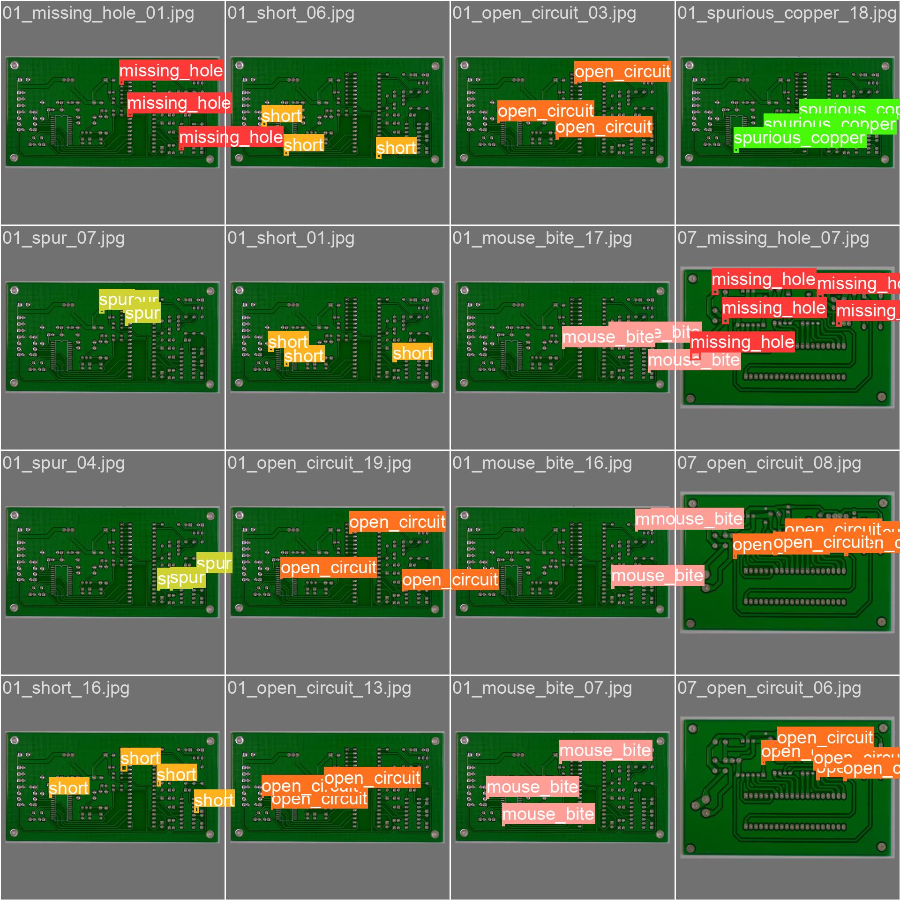
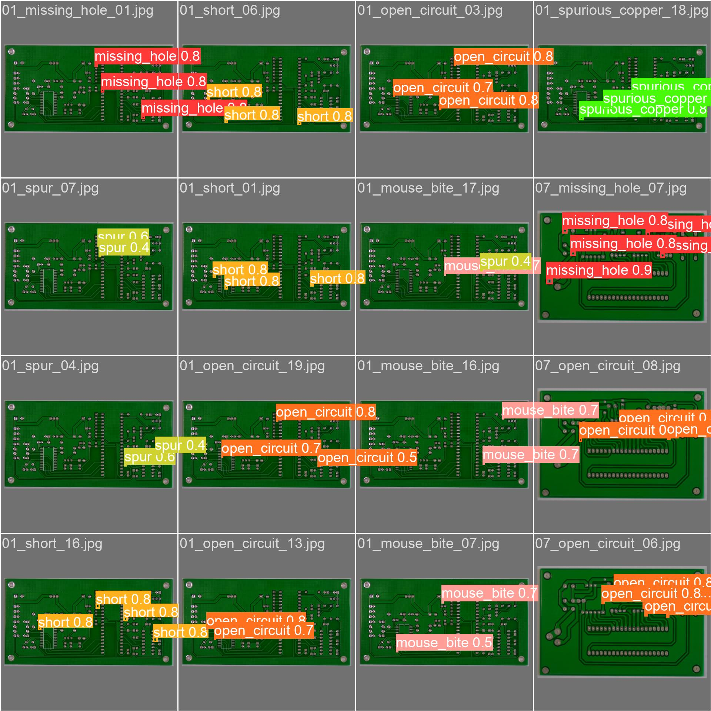
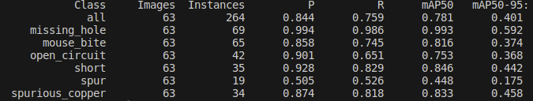
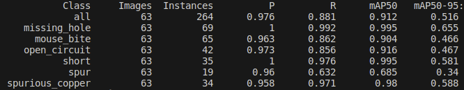
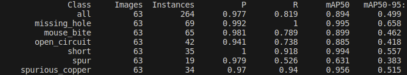
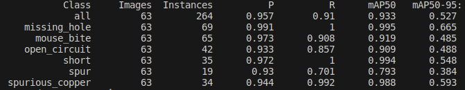
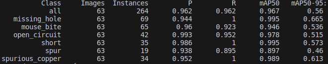

yolo5_pcb_defect_detection
===
# 数据集
地址：https://robotics.pkusz.edu.cn/resources/dataset/
- 印刷电路板（PCB）瑕疵数据集。它是一个公共合成PCB数据集，包含1386张图像，具有6种缺陷（漏孔、鼠咬、开路、短路、杂散、杂铜），用于图像检测、分类和配准任务。
- 实际只有693张图像,主要为小目标缺陷检测
- 图像分辨率：1586*3034

# 训练（按9:1划分数据集）
|序号|模型|batctsize|epoch|参数配置|mAP50|
|---|---|---|---|---|---|
|1(baseline)|yolov5s|64|300|no-augmenttation|0.781|
|2|yolov5s|64|300|scratch_low|0.912|
|3|yolov5s|64|300|scratch_low_modify(adamw+focalloss+flipud)|0.894|
|4|yolov5s|64|300|scratch_low_modify(adamw+flipud)|0.933|
|5|yolov5m|64|300|scratch_low_modify(adamw+flipud)|**0.967**|
# 最终效果
- **GT**
    
- **predict**
    

# [train code]()

# 详细数据
- 序号1(baseline)
    
- 序号2
    
- 序号3
    
  - 当数据集类别数量较为平衡，增加focalloss反而会降低模型性能
- 序号4
    
- 序号5
    

# 瑞芯微开发板部署(todo)