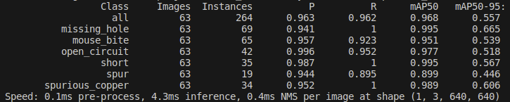
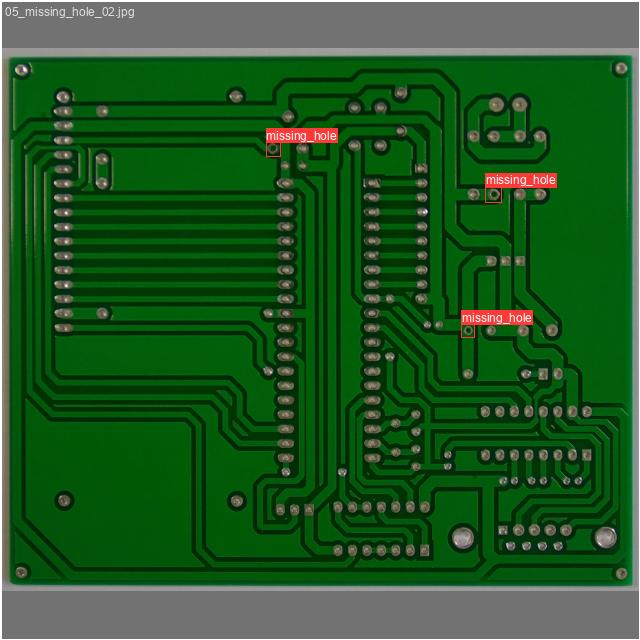
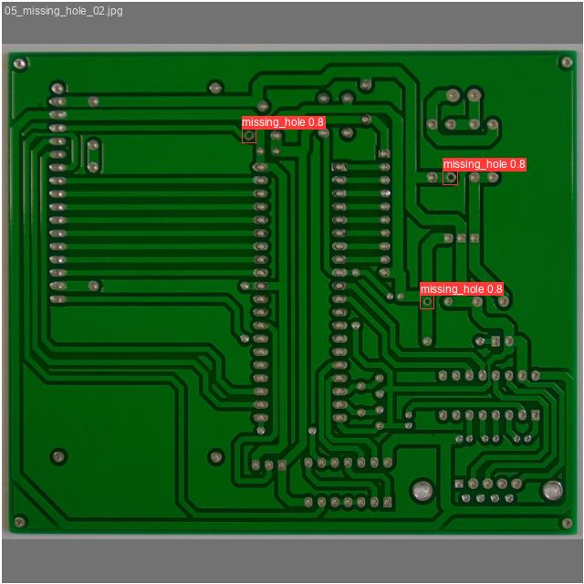

yolo5_pcb_defect_detection
===
# 数据集
地址：https://robotics.pkusz.edu.cn/resources/dataset/
- 印刷电路板（PCB）瑕疵数据集。它是一个公共合成PCB数据集，包含1386张图像，具有6种缺陷（漏孔、鼠咬、开路、短路、杂散、杂铜），用于图像检测、分类和配准任务。
- 实际只有693张图像,主要为小目标缺陷检测
- 图像分辨率：1586*3034

# 训练（按9:1划分数据集）
|序号|模型|batctsize|epoch|参数配置|mAP50|
|---|---|---|---|---|---|
|1(baseline)|yolov5s|64|300|no-augmenttation|0.781|
|2|yolov5s|64|300|scratch_low|0.912|
|3|yolov5s|64|300|scratch_low_modify(adamw+focalloss+flipud)|0.894|
|4|yolov5s|64|300|scratch_low_modify(adamw+flipud)|0.933|
|5|yolov5m|64|300|scratch_low_modify(adamw+flipud)|**0.967**|
# 最终效果
- **GT**
    
- **predict**
    

# [train code]()


# 详细数据
- 序号1(baseline)
  - 
- 序号2
  - 
- 序号3
  - 
  - 当数据集类别数量较为平衡，增加focalloss反而会降低模型性能
- 序号4
  - 
- 序号5
  - 

# YOLOv5m瑞芯微PK3568部署（默认已经安装交叉编译工具和板端更新了npu）
- [为更新可查看该文件内容](../../Data/瑞芯微部署/瑞芯微部署.md#L18)
1. 转ONNX
```
python export.py --weights ./run/train/exp4/weight/best.pt --include onnx --device 0
# 可能出现问题 Unsupported ONNX opset version:17 ->opset 可修改为12测试 
```
- 生成onnx测试结果
    - 性能测试
      - 预处理 0.1ms 
      - 推理   4.3ms
      - 后处理 0.4ms
      - 
    - gt和pre效果对比
      - gt
      - pre
2. 计算机端环境搭建
    1. 新建 Projects项目 文件夹
    
    ```
    mkdir Projects
    ```
    2. 进入该目录
    ```
    cd Projects
    ```
    3. 下载 RKNN-Toolkit2 仓库
    ```
    git clone https://github.com/airockchip/rknn-toolkit2.git --depth 1
    ```
    4. 下载 RKNN Model Zoo 仓库
    ```
    git clone https://github.com/airockchip/rknn_model_zoo.git --depth 1
    ```
    5. 注意：
       1. 1.参数 --depth 1 表示只克隆最近一次 commit
       2. 2.如果遇到 git clone 失败的情况，也可以直接在 github 中下载压缩包到本地，然后
       解压至该目录
    6. 新建conda环境
        ```
        conda create -n toolkit2 python=3.8
        进入conda环境
        conda activate toolkit2 
        ```
    7. 进入 rknn-toolkit2 目录
        ```
        cd Projects/rknn-toolkit2/rknn-toolkit2
        ```
    8. 请根据不同的 python 版本，选择不同的 requirements 文件 ,例如 python3.8 对应 requirements_cp38.txt 
          ```
          pip install -r doc/requirements_cpxx.txt
          ```
    9. 安装 RKNN-Toolkit2
          1. 请根据不同的 python 版本及处理器架构，选择不同的 wheel 安装包文件：
          2. 其中 x.x.x 是 RKNN-Toolkit2 版本号，xxxxxxxx 是提交号，cpxx 是 python 版本号，请根据实际数值进行替换
        ```
        pip install packages/rknn_toolkit2-x.x.x+xxxxxxxx-cpxx-cpxxlinux_x86_64.whl
        ```
    10. 测试是否安装成功
        ```
        # 进入 Python 交互模式
        python
        # 导入 RKNN 类
        from rknn.api import RKNN
        ```
3. [pytorch转onnx](./files/export.py)
  YOLOv5源码的export.py可直接使用
1. [onnx转rknn](./files/onnx2rknn.py)
2. [python程序部署](./files/pcb_yolov5_rknn_test.py)
   |精度|FPS|问题|
   |--|--|--|
   |FP16|1.84|-|
   |INT8|5.01|confidence输出为0|
   |hybrid|2.85|-|
    - 量化问题记录
      1. int8量化后confidenc都变成0了
          - 原因：conf和bbox在一个解码头上，
          - 解决方式：sigmoid激活函数层修改
3. c++程序部署(todo)