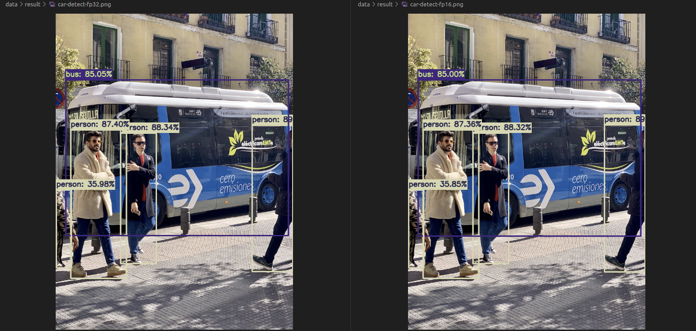
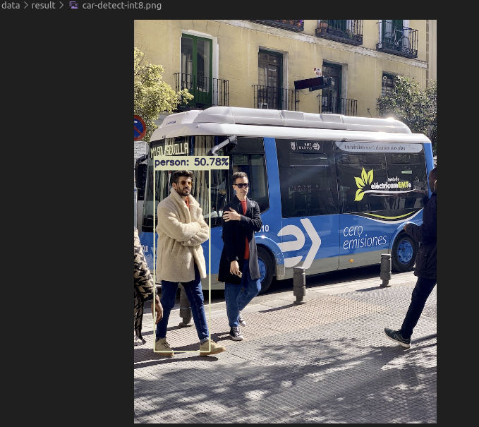
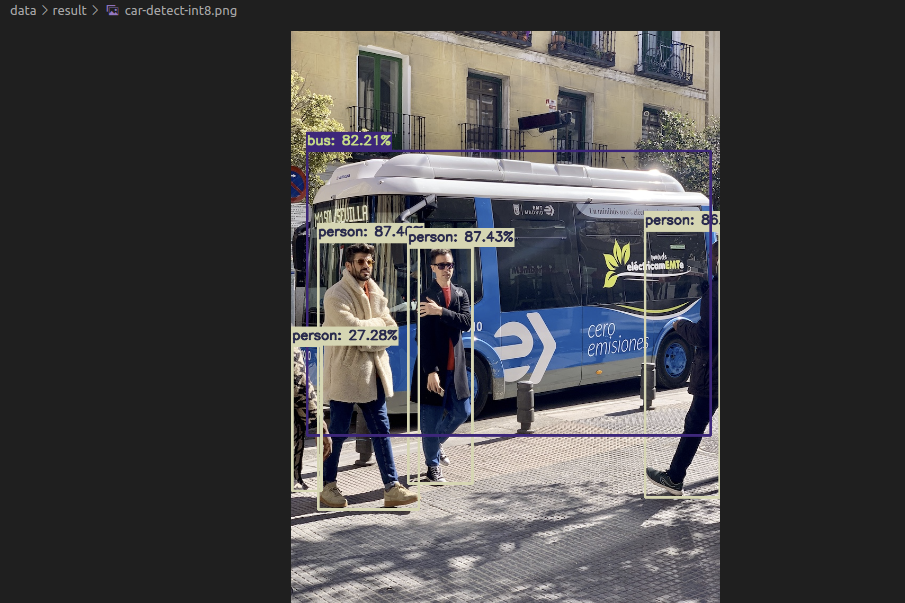

yolov8部署
===
# 环境
- ubuntu 20.04
- python=3.8
- cuda=11.1
- TensorRT=8.5.1
- torch=1.10.1
- 4090 24G
# 使用yolov8n.pt转onnx
```
# 直接执行即可会直接拉取预训练的yolov8n.pt
from ultralytics import YOLO

# Load a model
model = YOLO('yolov8n.pt')  # load an official model
#model = YOLO('path/to/best.pt')  # load a custom trained model

# Export the model
model.export(format='onnx')
```
# 转 FP32&FP16 Tensorrt效果
- 精度上没有太大变化
    - 左边fp32 右边fp16

- 耗时（推理部分）
    - fp32->0.94ms
    - fp16->0.54ms
# 转INT8 Tensorrt效果
## 默认配置转IN8结果
- 精度->recall急剧下降且confidence只有量化前一半

- 耗时（推理部分）
    - 0.44ms（提升不明显）
### 精度存在问题，进行排查
- 对比其他结果，bbox位置都是准确的，只有confidence下降明显
    - 暂时排除输入输出端导致问题
- 是否calibrator问题
    - 原始配置：IIint8EntropyCalibrator2
    - 尝试使用：IIint8MinMaxCalibrator（只是confidence稍微降低，大体得到解决）


# 获取TensorRT模型结构
- 用于查看每一层输出输出是int8还是fp32
- 安装：https://github.com/NVIDIA/TensorRT/tree/release/8.6/tools/experimental/trt-engine-explorer
- 使用：https://github.com/NVIDIA/TensorRT/tree/release/8.6/tools/experimental/trt-engine-explorer/utils
    - 使用process_engine.py导出graph
        - python process_engine.py /path/to/engin save/path --profile-enigne
    - 使用draw_engine.py 生成svg图片
        - python draw_engine.py /path/to/graph.json
[结构图](./yolov8n-int8.engine.graph.json.svg)