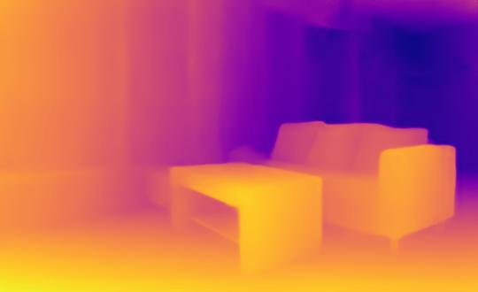
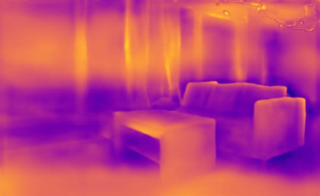

LapDepth
===
---
# 瑞芯微RK3568部署
|数据类型|FPS|问题|
|--|--|--|
|FP16|0.13|绝对深度估计精度下降较多，部分深度为4的变成2|
|混合量化|-|该部分仅测试速度|

## 可视化（转化成相对深度）
- FP32
  
- FP16
  
- 数值对比
  - 可看到右上角深度数值由4下降为2
    

- 精度下降可能原因
  - 预训练模型未训练到位，权重未到比较鲁棒的状态
  - 激活函数问题